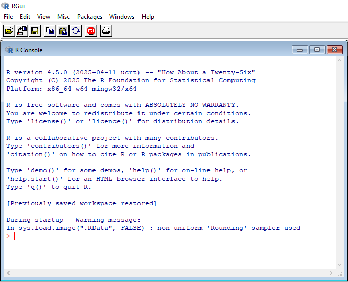
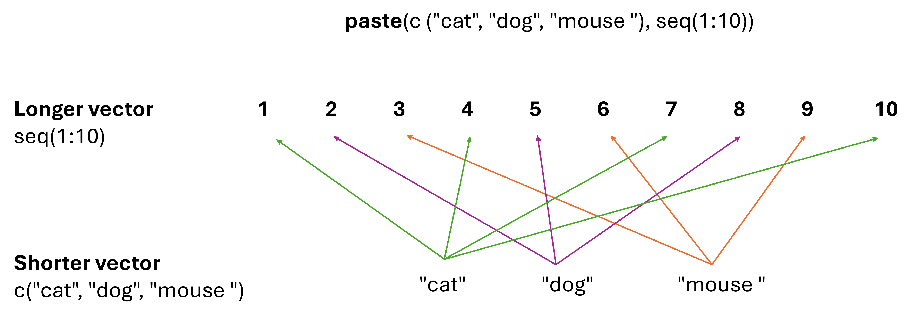

```{r setup, include=F}
knitr::opts_chunk$set(echo = F)
```

<span style="color: green">**Descriptions of exercises are in green**</span>  
<span style="color: #da205eff;">**Homeworks are in pink**</span>

## What is R?
R is an extremely powerful programming language, broadly used in science for:

  - data processing
  - statistical analysis
  - production of highly customizable, publication-quality graphs
  - computer simulations
  - … and much more
  
### R installation

To install R for Windows, follow the [link](https://cran.uni-muenster.de/bin/windows/base/) and then click on “Download R – *version_number* – for Windows”.  
To install R for macOS (Macs), follow the [link](https://cran.uni-muenster.de/) and then click on “Download R for (Mac) OS X”  
To install R for Linux, type the lines below in the terminal. 

```{r, engine = 'bash', eval = FALSE, echo = T}
sudo apt-get update
sudo apt-get install r-base
```
Run R. You should see a window similar to the one below. 



It is the so-called **R console**. Anything written and executed within a console will be interpreted (calculated) by R, and the result or message will be printed out in the console.

## Note on Programming Vocabulary
 -	**console**: the window in which you type lines of code and the output is displayed
 -	**input**: what you give to R to work on, such as commands, values, or files
 -	**output**: what R displays back to you, typically the result of an operation
 -	**call**: run the code or prompt the computer to produce output
 -	**function**: instruction given by us to R about what to do with our input
 -	**object**: the thing you work on in R

## RStudio

RStudio is a **programming environment**, which combines **console, text editor and other useful things** for the R language. It makes working with R much easier and more intuitive by providing a **user interface** to R features originally hidden behind R functions. However, remember that **all actions can also be performed within the classical R console**. 

### RStudio installation

Follow the [link](https://posit.co/download/rstudio-desktop/), choose the appropriate operating system, and install free **RStudio Desktop**. Have in mind that **R needs to be installed first**.
  
The RStudio interface is divided into four main panels, but today we will focus only on **the Console** panel, located in the lower-left corner. In the following classes, we will explore the other three panels and learn how to use them effectively.


## R as a typical calculator
R understands standard mathematical operators: `+` (addition), `-` (subtraction), `*` (multiplication), `/` (division), and `^` (power). We can perform mathematical operations on single values – numbers, as well as other objects made up of numbers.

### <span style="color: green">**Exercise 1**</span>

<span style="color: green">**Sum up all numbers from 1 to 10 using the `+` operator.**</span>  
Expected result:

```{r}
1+2+3+4+5+6+7+8+9+10
```

### <span style="color: green">**Exercise 2**</span>

<span style="color: green">**Raise the result of exercise 1 to the power of 5.**</span>  
Expected result:

```{r}
55^5
```

R also provides 2 additional operators:  
  `%%` - modulo - returns the reminder from the division  
  `%/%` - integer division - returns how many times one number fits into another


### <span style="color: green">**Exercise 3**<span>
<span style="color: green">**For numbers 10, 156, 557, 777, and 1055, check which are divisible by 7.**</span>  
Expected result:
```{r}
10 %% 7
156 %% 7
557 %% 7
777 %% 7
1055 %% 7
```


### <span style="color: green">**Exercise 4**</span>
<span style="color: green">**Calculate the area of a circle if the radius equals 40 meters.**</span>

*Tip: Due to its unique role in science `π` value can be obtained just by typing 'pi'*.  
Expected result:

```{r}
pi*(40^2)
```

*Advice: R follows the standard order of mathematical operations. However, it is usually a good practice to use parentheses.*

Apart from that, there are also commonly used mathematical functions as:

**`log()`** - natural logarithm  
**`log10()`** - logarithm base 10  
**`exp()`** - exponent, Euler number raised to a given power  
**`sin()`, `cos()`, `tan()`** - trigonometric functions  
**`abs()`** - absolute value

You can use them by including the desired number inside the parentheses, e.g. exponent of e for `exp()` or an angle in radians for any of the trigonometric functions.

### <span style="color: green">**Exercise 5**</span>
<span style="color: green">**Using the equation for Shannon - Wiener index and species frequencies shown below, calculate diversity for both populations separately. Which is more diverse (higher values reflect more diverse populations)?**</span>


$$
H_{SW} = \sum_{i=1}^{S} p_i \cdot \ln\left(\frac{1}{p_i}\right)
$$


Where:  

- \(H_{SW}\) is the Shannon-Wiener diversity index,  
- \(S\) is the total number of species,  
- \(p_i\) is the  frequency of the given species,  
- \(\ln\) is the natural logarithm.  

<center>

| Species    | Population 1| Population 2|
|:----------:|:-----------:|:-----------:|
| species 1  |     0.8     |    0.2      |
| species 2  |     0.1     |    0.2      |
| species 3  |     0.1     |    0.6      |

</center>

Expected result:

```{r}

#population 1 
(0.8*log(1/0.8))+(0.1*log(1/0.1))+(0.1*log(1/0.1))

#population 2
(0.2*log(1/0.2))+(0.2*log(1/0.2))+(0.6*log(1/0.6))
```

## Variables

**Until you name something, it does not exist in a computer memory!** Any outcome of the execution of a command within the console perishes when the calculation is finished, unless it is **assigned to a given name**. Named objects within the computer memory are called *variables*. You can create one **by using the arrow (assignment symbol)** in the following manner:

`chosen_name <- object_to_be_saved`  

You can easily recall the value of the variable later on **by typing its name**.

### <span style="color: green">**Exercise 6**</span>
<span style="color: green">**Try to save 5 as a variable. Choose a variable name on your own. Then, type your variable’s name and press Enter.**</span>

Expected result:

```{r}
x <- 5
x
```

*Advice: The variable name is case sensitive and **cannot contain blank spaces or start with a digit**. When you want to combine several words into one name, use the underscore (`_`). By convention, dots are used for function names and should be used with caution.*

Once the variable is saved, its name can replace the actual value in any R commands, e.g. if 2 is assigned to x, both `2+3` and `x+3` would result in 5.

### <span style="color: green">**Exercise 7**</span>
<span style="color: green">**Using the table from exercise 5, calculate the range of species frequencies for both populations and save them as separate variables. Then, using chosen names, calculate the absolute difference between ranges. Save it to a variable called `range_diff` and call it.**</span>

Expected result:

```{r}
range1 <- 0.8-0.1
range2 <- 0.6-0.2
range_diff <- abs(range2-range1)
range_diff
```

Variables can also be **overwritten**. It is done by assigning a new object to the already used variable’s name. Remember, however, that once you overwrite the variable, **the old value disappears for good**.

### <span style="color: green">**Exercise 8**</span>
<span style="color: green">**Change variable `range_diff` by increasing its value by 20%. Call it.**</span>

Expected result:

```{r}
range_diff <- range_diff + (range_diff*0.20)
range_diff
```

Variables can store not only numbers. The other very popular type of data is a **string**. It is a text that behaves as a single object regardless of its length. To distinguish strings from variable names, R requires the use of **quotation marks** (`""`) around them.

### <span style="color: green">**Exercise 9**</span>
<span style="color: green">**Save your name to the variable `my_name`. Call it.**</span>

Expected result:

```{r}
my_name <- "Your Name"
my_name
```

## Functions

One of the usual ways to deal with your data in R is to use **functions**. They are simply lines of code saved in a computer memory that perform desired operations and often return a result. Some functions are **built into R**, and some require additional tools called **packages** to be installed. Think apps pre-loaded on your phone, like a calculator or a calendar, vs apps for specific uses you need to download separately. We will talk about packages in the next class. 

Functions we used before take only a single argument, e.g., `log()` takes a number. However, it is rarely the case. The list of the function’s arguments and the way of usage can be found in the **function’s manual**. It can be reached by typing a question mark (`?`) followed by the function’s name.

### <span style="color: green">**Exercise 10**</span>
<span style="color: green">**Open the manual for the `paste()` function.**</span>

Usually, the manual consists of 7 sections:

  - **DESCRIPTION** - the aim of the function
  - **USAGE** - the syntax
  - **ARGUMENTS** - arguments passed to the function and their meaning
  - **DETAILS** - detailed description of the function behaviour
  - **VALUE** - outcome of the function
  - **REFERENCES** - often the scientific article function is based on  
  - **EXAMPLES**
  
### <span style="color: green">**Exercise 11**</span>
<span style="color: green">**Use the `paste()` function to stick the following words together: 'I’m’, ‘using’, and ‘R’. Don’t forget about quotation marks (`""`).**</span>

Expected result:

```{r}
paste("I’m", "using", "R")
```

Arguments passed to functions often have their own names. Distinctive names are crucial because many functions take multiple arguments that need to be distinguished. Such named arguments are passed in the following pattern: 
`argument_name = argument_value`.

### <span style="color: green">**Exercise 12**</span>

<span style="color: green">**Use the same function as above, but set another argument called `sep` (separator) to  ’\_’.**</span>

Expected result:

```{r}
paste("I’m", "using", "R", sep = "_")
```

Note that the blank space was replaced with an underscore. However, where did the blank spaces in the Exercise 11 result come from? The answer is that **some arguments have their default values** that would be taken if no value is put into the function.
In the above case, the default value for the `sep` argument is a blank space (” “).

*Advice: It is a good practice to use argument names while calling a function. Although R can “guess” the argument name by the order in which arguments are typed, it can work improperly when the number of arguments is not strictly defined (`…` sign in function description).*

## Vectors

A vector is a series of numbers (or strings) that are saved as a single **variable**. A new vector can be created with `c()` function in the following manner: `c(value_1,value_2,value_3,…)`.

### <span style="color: green">**Exercise 13**</span>
<span style="color: green">**Create a vector containing integers from 5 to 10 and save it to a variable. Call it.**</span>

Expected result:

```{r}
v1 <- c(5:10)
v1
```

*Tip: To create a vector of consecutive integers, you can type the limits of the range separated by a colon.*

### <span style="color: green">**Exercise 14**</span>
<span style="color: green">**Create a vector containing integers from 1 to 100 and save it to a variable `one_to_hundred`. Call it.**</span>

Expected result:

```{r}
one_to_hundred <- c(1:100)
one_to_hundred
```

*Advice: Note that concerning ranges, R is fully inclusive, which means that both limits of the range will be included in the outcome.*

To create a vector of consecutive numbers that differ by a given value, use the `seq()` function. Note that the function will return a vector, so there is no need to use `c()`.

### <span style="color: green">**Exercise 15**</span>
<span style="color: green">**Access the `seq()` manual. Using the `seq()` function, create a vector of numbers between 0 and 1 that differ by 0.1.**</span>

Expected result:

```{r}
v2 <- seq(from = 0, to = 1, by = 0.1)
v2
```

To create a vector of repeated values, use the `rep()` function.

### <span style="color: green">**Exercise 16**</span>
<span style="color: green">**Access the `rep()` manual. Using the `rep()` function, create a vector consisting of 1,2, and 3 repeated 20 times. Save it as a variable `repeated`. Call it.**</span>

```{r}
repeated <- rep(x = c(1:3), times = 20)
repeated
```

### <span style="color: green">**Exercise 17**</span>
<span style="color: green">**Create a vector from 1 to 4 with odd numbers typed as digits and even numbers typed as words. What is the outcome? Vector of integers or vector of strings?**</spam>

Expected result:

```{r}
v4 <- c(1, "two", 3, "four")
v4
```

## Vector machinations

Useful functions:  
**`min()`** - minimum value  
**`max()`**- maximum value  
**`sum()`** - sum up all numbers in a vector  
**`prod()`** - multiply all numbers in a vector  
**`mean()`** - average value  
**`median()`** - central value  
**`length()`** - number of elements in a vector  
**`sort()`** - sort values (default is ascending order, use decreasing argument to sort in descending order)  
**`unique()`** - return unique values  
**`round()`** - round numbers (to integers by default)  

### <span style="color: green">**Exercise 18**</span>
<span style="color: green">**Having a vector `one_to_hundred` calculate its mean and median.**</span>

Expected results:

```{r}
mean(one_to_hundred)
median(one_to_hundred)
```
### <span style="color: green">**Exercise 19**</span>
<span style="color: green">**Having a vector `repeated` sort it and return unique values.**</span>

Expected results:

```{r}
sort(repeated)
unique(repeated)
```

Vectors can also be used in typical mathematical operations. However, there is one important role of recycling: **the shorter vector will be repeated until it reaches the length of the longer one** (a single number is treated as a vector of length 1).

Examples:

 
```{r, eval=F, echo=T}
c(1,2,3,4) + 5   # 5 is added to each element, the same as c(1,2,3,4) + c(5,5,5,5)

```


```{r}
c(1,2,3,4) + 5  

```


```{r, eval=F, echo=T}
c(1,2,3,4) + c(1,2)   # the same as c(1,2,3,4) + c(1,2,1,2)
```


```{r}
c(1,2,3,4) + c(1,2)
```

```{r, eval=F, echo=T}
paste("text", seq(1:10))   # Similarly here - the shorter vector including 1 element ("text") is repeated 10 times to reach the length of the longer vector.

```

```{r}
paste("text", seq(1:10))

```



The result:

```{r}

paste(c("cat", "dog", "mouse"), seq(1:10))
```


### <span style="color: green">**Exercise 20**</span>
<span style="color: green">**Having a vector `one_to_hundred`, raise each element to the power of 3. Save it to a variable called `power_3`.**</span>

Expected result:

```{r}
power_3 <- one_to_hundred^3
power_3
```

## Accessing elements of a vector

A vector can be **subsetted** (=accessed or displayed at a specific point) in the following manner: `vector_name[element_index]`. **Index** is the position of the value in the vector, e.g., 1st, 3rd, 25th, etc. 

### <span style="color: green">**Exercise 21**</span>
<span style="color: green">**Return the 15th element of the vector `power_3`.**</span>

Expected result:

```{r}
power_3[15]
```

### <span style="color: green">**Exercise 22**</span>
<span style="color: green">**Return the 2nd to 20th element of the vector `power_3`.**</span>

*Tip: Colon can be used for ranges just as for vector creation.*

Expected result:

```{r}
power_3[2:20]
```
### <span style="color: green">**Exercise 23**</span>
<span style="color: green">**Return the 15th, 30th, and 45th elements of the vector `power_3`.**</span>

*Tip: To obtain multiple values, put a vector instead single position index.*

Expected result:

```{r}
power_3[c(15,30,45)]
```

### <span style="color: green">**Exercise 24**</span>
<span style="color: green">**Create a vector including numbers from 1 to 10, 40 and 55. Save it to a variable. Return corresponding elements of the vector `power_3` with the use of previously saved variable.**</span>

*Tip: While creating a vector, you can combine both ranges and single indexes with `c()` function.*

Expected result:

```{r}
numbers <- c(1:10, 40, 55)
power_3[numbers]
```

## Before leaving

If you want to save your code written during the class, type the commands below to save the R history.

```{r, eval=F, echo=T}
savehistory(file = "my_history.txt")     # saves your R history to the file "my_history.txt"
getwd()                                  # displays where the file was saved
```


## <span style="color: #da205eff;">Homework</span>

<span style="color: #da205eff">
**Please save all your R commands in a plain text file and call it "class_1_homework_Your_Name.txt" (replace "Your_Name" with your actual name). Then, upload the file to the `Class 1` tab on the Pegaz platform.**  
  1. Create a vector of the number of days in each month called `days`. The vector should have 12 elements and contain only numbers. Assume it is not a leap year.  
  2. Using vector `days`, find the median number of days in a month and save it to a new variable called `median_days`.  
  3. Using vector `days`, find the difference (in days) between the longest and shortest month and save it to a new variable called `range_days`. Find the longest and shortest month using R functions.
  4. Using vector `days`, get a vector of unique month lengths and call a new vector `month_length`.  
  5. Overwrite the `days` vector by replacing it with the number of minutes in each month.
</span>

