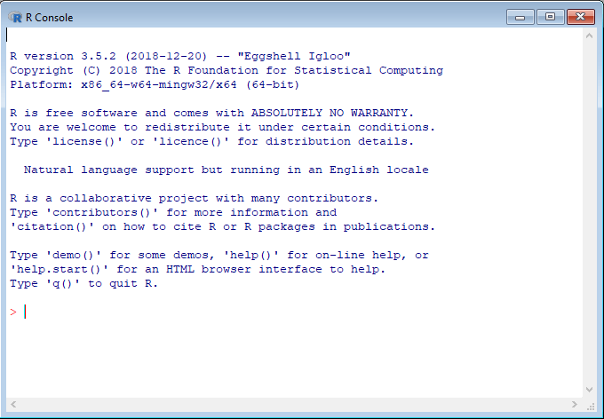
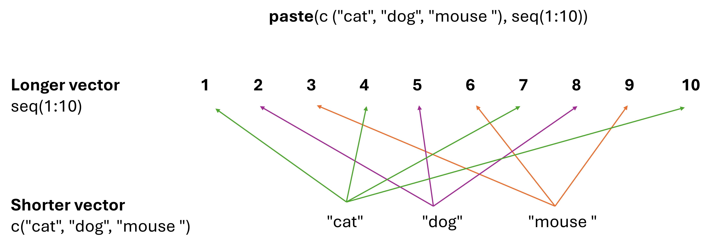

Introduction to R - class 1<br> <span style="color: gray">variables,
functions, vectors</span>
================
Tomasz Gaczorek, Wiesław Babik & Mateusz Chechetkin <br>Marzena
Marszałek<br> <marzena.marszalek@doctoral.uj.edu.pl><br>
2024-10-01

- [What is R?](#what-is-r)
- [R installation](#r-installation)
- [Note on Programming Vocabulary](#note-on-programming-vocabulary)
- [R as a typical calculator](#r-as-a-typical-calculator)
  - [<span style="color: green">**Exercise 1**</span>](#exercise-1)
  - [<span style="color: green">**Exercise 2**</span>](#exercise-2)
  - [<span style="color: green">**Exercise 3**<span>](#exercise-3)
  - [<span style="color: green">**Exercise 4**</span>](#exercise-4)
  - [<span style="color: green">**Exercise 5**</span>](#exercise-5)
- [Variables](#variables)
  - [<span style="color: green">**Exercise 6**</span>](#exercise-6)
  - [<span style="color: green">**Exercise 7**</span>](#exercise-7)
  - [<span style="color: green">**Exercise 8**</span>](#exercise-8)
  - [<span style="color: green">**Exercise 9**</span>](#exercise-9)
- [Functions](#functions)
  - [<span style="color: green">**Exercise 10**</span>](#exercise-10)
  - [<span style="color: green">**Exercise 11**</span>](#exercise-11)
  - [<span style="color: green">**Exercise 12**</span>](#exercise-12)
- [Vectors](#vectors)
  - [<span style="color: green">**Exercise 13**</span>](#exercise-13)
  - [<span style="color: green">**Exercise 14**</span>](#exercise-14)
  - [<span style="color: green">**Exercise 15**</span>](#exercise-15)
  - [<span style="color: green">**Exercise 16**</span>](#exercise-16)
  - [<span style="color: green">**Exercise 17**</span>](#exercise-17)
- [Vector machinations](#vector-machinations)
  - [<span style="color: green">**Exercise 18**</span>](#exercise-18)
  - [<span style="color: green">**Exercise 19**</span>](#exercise-19)
  - [<span style="color: green">**Exercise 20**</span>](#exercise-20)
- [Accessing elements of a vector](#accessing-elements-of-a-vector)
  - [<span style="color: green">**Exercise 21**</span>](#exercise-21)
  - [<span style="color: green">**Exercise 22**</span>](#exercise-22)
  - [<span style="color: green">**Exercise 23**</span>](#exercise-23)
  - [<span style="color: green">**Exercise 24**</span>](#exercise-24)
- [Before leaving](#before-leaving)
- [<span style="color: darkorange;">Homework</span>](#homework)

## What is R?

R is an extremely powerful programming language, broadly used in the
science for:

- data processing
- statistical analysis
- production of highly-customizable, publication quality graphs
- computer simulations
- … and much more

## R installation

To install R for Windows follow the
[link](https://cran.uni-muenster.de/bin/windows/base/) and then click on
“Download R – *version_number* – for Windows”.  
To install R for OS X (Macs) follow the
[link](https://cran.uni-muenster.de/) and then click on “Download R for
(Mac) OS X”  
To install R for Linux type the lines below in the terminal.

Run R. You should see a window similar to the one below.



It is so called **R console**. Anything written and executed within a
console will be interpreted (calculated) by R and a result or message
will be printed out in the console.

## Note on Programming Vocabulary

- **console**: the window in which you type lines of code and receive
  the result of the code running
- **input**: what you give to R to work on, such as commands, values, or
  files
- **output**: what R displays back to you, typically the result of an
  operation
- **call**: run the code or prompt the computer to produce output
- **function**: instruction given by us to R about what to do with our
  input
- **object**: the thing you work on in R

<span style="color: green">**Descriptions of exercises are in
green.**</span>  
<span style="color: darkorange;">**Homeworks are in orange**</span>

## R as a typical calculator

R understands standard mathematical operators: `+` (addition), `-`
(subtraction), `*` (multiplication), `/` (division) and `^` (power). We
can perform mathematical operations on single values – numbers, as well
as other objects made up of numbers.

### <span style="color: green">**Exercise 1**</span>

<span style="color: green">**Sum up all numbers from 1 to 10 using the
`+` operator.**</span>  
Expected result:

    ## [1] 55

### <span style="color: green">**Exercise 2**</span>

<span style="color: green">**Raise the result of exercise 1 to the power
of 5.**</span>  
Expected result:

    ## [1] 503284375

R also provides 2 additional operators:  
`%%` - modulus - returns the rest from the division  
`%/%` - integer division - returns how many times one number fits into
another

### <span style="color: green">**Exercise 3**<span>

<span style="color: green">**For numbers 10, 156, 557, 777 and 1055,
check which are divisible by 7.**</span>  
Expected result:

    ## [1] 3

    ## [1] 2

    ## [1] 4

    ## [1] 0

    ## [1] 5

### <span style="color: green">**Exercise 4**</span>

<span style="color: green">**Calculate the area of a circle if the
radius equals 40 meters.**</span>

*Tip: Due to its unique role in science `π` value can be obtained just
by typing ‘pi’*.  
Expected result:

    ## [1] 5026.548

*An advice: R uses the standard order of mathematical operations.
However, it is usually a good practice to use parentheses.*

Apart from that, there are also commonly used mathematical functions as:

**`log()`** - natural logarithm  
**`log10()`** - logarithm base 10  
**`exp()`** - exponent, Euler number raised to a given power  
**`sin()`, `cos()`, `tan()`** - trigonometric functions  
**`abs()`** - absolute value

You can use them by including the desired number inside the parentheses
e.g. exponent of e for `exp()` or an angle in radians for any of
trigonometric functions.

### <span style="color: green">**Exercise 5**</span>

<span style="color: green">**Using the equation for Shannon - Wiener
index and species frequencies shown below, calculate diversity for both
populations separately. Which is more diverse (higher values reflect
more diverse populations)?**</span>

$$
H_{SW} = \sum_{i=1}^{S} p_i \cdot \ln\left(\frac{1}{p_i}\right)
$$

Where:

- $H_{SW}$ is the Shannon-Wiener diversity index,  
- $S$ is the total number of species,  
- $p_i$ is the frequency of given species,  
- $\ln$ is the natural logarithm.

<center>

|  Species  | Population 1 | Population 2 |
|:---------:|:------------:|:------------:|
| species 1 |     0.8      |     0.2      |
| species 2 |     0.1      |     0.2      |
| species 3 |     0.1      |     0.6      |

</center>

## Variables

**Until you name something it does not exist in a computer memory!** Any
outcome of the execution of a command within the console perishes when
the calculation is finished, unless it is **assigned to a given name**.
Named objects within the computer memory are called *variables*. You can
create one by using arrows (assignement symbol) in the following manner:

`chosen_name <- object_to_be_saved`

You can easily recall the value of the variable later on by typing its
name.

### <span style="color: green">**Exercise 6**</span>

<span style="color: green">**Try to save 5 as variable. Choose a
variable name on your own. Then, type your variable’s name and press
Enter.**</span>

Expected result:

    ## [1] 5

*An advice: The variable name is case sensitive and cannot contain blank
spaces or start with a digit. When you want to combine several words
into one name use the underscore (\_). By convention dots are used for
function names and should be used with caution.*

Since the variable is saved, its name can replace the actual value in
any R commands e.g. if 2 is assigned to x, both `2+3` and `x+3` would
result in 5.

### <span style="color: green">**Exercise 7**</span>

<span style="color: green">**Using the table from exercise 5, calculate
the range of species frequencies for both populations and save them as
separate variables. Then using chosen names, calculate the absolute
difference between ranges. Save it to a variable called `range_diff` and
call it.**</span>

Expected result:

    ## [1] 0.3

Variables can also be **overwritten**. It is done by assigning a new
object to the already used variable’s name. Remember, however, that once
you overwrite the variable **the old value disappears for good**.

### <span style="color: green">**Exercise 8**</span>

<span style="color: green">**Change variable `range_diff` by increasing
its value by 20%. Call it.**</span>

Expected result:

    ## [1] 0.36

Variables can store not only numbers. The other very popular type of
data is **string**. It is a text which behaves as a single object
regardless of its length. To distinguish strings from variable names R
requires usage of **quotation marks** around them.

### <span style="color: green">**Exercise 9**</span>

<span style="color: green">**Save your name to the variable `my_name`.
Call it.**</span>

Expected result:

    ## [1] "Your_Name"

## Functions

One of the usual ways to deal with your data in R is to use
**functions**. They are simply lines of code saved in a computer memory
that perform desired operations and often return a result. Some
functions are **built into R**, and some require additional tools called
**libraries** to be installed. Think apps pre-loaded on your phone like
a calculator or a calendar vs apps for specific uses you need to
download separately. We will talk about function libraries in the next
class.

Functions we used before take only a single argument e.g. `log()` takes
a number. However, it is rarely the case. List of function’s arguments
and the way of usage can be found in **function’s manual**. It can be
reached by typing `?` followed by the function’s name.

### <span style="color: green">**Exercise 10**</span>

<span style="color: green">**Open the manual for `paste()`
function.**</span>

Usually the manual consists of 7 sections:

- **DESCRIPTION** - the aim of the function
- **USAGE** - the syntax
- **ARGUMENTS** - arguments passed to the function and their meaning
- **DETAILS** - detailed description of the function behaviour
- **VALUE** - outcome of the function
- **REFERENCES** - often the scientific article function is based on  
- **EXAMPLES**

### <span style="color: green">**Exercise 11**</span>

<span style="color: green">**Use `paste()` function to stick the
following words together: ‘I’m’, ‘using’ and ‘R’. Don’t forget about
quotation marks.**</span>

Expected result:

    ## [1] "I’m using R"

Arguments passed to functions often have their own names. Distinctive
names are crucial because many functions take multiple arguments that
need to be distinguished. Such named arguments are passed in the
following pattern: `argument_name = argument_value`.

### <span style="color: green">**Exercise 12**</span>

<span style="color: green">**Use the same function as above but set
another argument called `sep` (separator) to ’\_’.**</span>

Expected result:

    ## [1] "I’m_using_R"

Note that the blank space was replaced with an underscore. However,
where did the blank spaces in the Exercise 11 result come from? The
answer is that **some arguments have their default values** that would
be taken if no value is put into function. In the above case, the
default value for `sep` argument is a blank space (” “).

*An advice: It is a good practice to use argument names while calling a
function. Although, R can “guess” the argument name by the order in
which arguments are typed, it can work improperly when the number of
arguments is not strictly defined (“…” sign in function description).*

## Vectors

Vector is a series of numbers (or strings) that are saved as a single
**variable**. A new vector can be created with `c()` function in the
following manner: `c(value_1,value_2,value_3,…)`.

### <span style="color: green">**Exercise 13**</span>

<span style="color: green">**Create a vector containing integers from 5
to 10 and save it to a variable. Call it.**</span>

Expected result:

    ## [1]  5  6  7  8  9 10

> Tip: To create a vector of consecutive integers you can type the
> limits of the range separated by the colon.

### <span style="color: green">**Exercise 14**</span>

<span style="color: green">**Create a vector containing integers from 1
to 100 and save it to a variable `one_to_hundred`. Call it.**</span>

Expected result:

    ##   [1]   1   2   3   4   5   6   7   8   9  10  11  12  13  14  15  16  17  18
    ##  [19]  19  20  21  22  23  24  25  26  27  28  29  30  31  32  33  34  35  36
    ##  [37]  37  38  39  40  41  42  43  44  45  46  47  48  49  50  51  52  53  54
    ##  [55]  55  56  57  58  59  60  61  62  63  64  65  66  67  68  69  70  71  72
    ##  [73]  73  74  75  76  77  78  79  80  81  82  83  84  85  86  87  88  89  90
    ##  [91]  91  92  93  94  95  96  97  98  99 100

*An advice: Note that concerning ranges, R is fully inclusive which
means that both limits of the range will be included in the final
outcome.*

To create a vector of consecutive numbers which differ by a given value,
use `seq()` function. Note that the function will return a vector so
there is no need to use `c()`.

### <span style="color: green">**Exercise 15**</span>

<span style="color: green">**Access `seq()` manual. Using `seq()`
function, create a vector of numbers between 0 and 1 that differ by
0.1.**</span>

Expected result:

    ##  [1] 0.0 0.1 0.2 0.3 0.4 0.5 0.6 0.7 0.8 0.9 1.0

To create a vector of repeated values, use `rep()` function.

### <span style="color: green">**Exercise 16**</span>

<span style="color: green">**Access `rep()` manual by typing `?rep` in
console. Using `rep()` function, create a vector consisting of 1,2 and 3
repeated 20 times. Save it as a variable`repeated`.**</span>

    ##  [1] 1 2 3 1 2 3 1 2 3 1 2 3 1 2 3 1 2 3 1 2 3 1 2 3 1 2 3 1 2 3 1 2 3 1 2 3 1 2
    ## [39] 3 1 2 3 1 2 3 1 2 3 1 2 3 1 2 3 1 2 3 1 2 3

### <span style="color: green">**Exercise 17**</span>

<span style="color: green">**Create a vector from 1 to 4 with odd
numbers typed as digits and even numbers typed as words. What is the
outcome? Vector of integers or vector of strings?**</spam>

Expected result:

    ## [1] "1"    "two"  "3"    "four"

## Vector machinations

Useful functions:  
**`min()`** - minimum value  
**`max()`**- maximum value  
**`sum()`** - sum up all numbers in a vector  
**`prod()`** - multiply all numbers in a vector  
**`mean()`** - average value  
**`median()`** - central value  
**`length()`** - number of elements in a vector  
**`sort()`** - sort values (default is ascending order, use decreasing
argument to sort in descending order)  
**`unique()`** - return unique values  
**`round()`** - round numbers (to integers by default)

### <span style="color: green">**Exercise 18**</span>

<span style="color: green">**Having a vector `one_to_hundred` calculate
its mean and median.**</span>

Expected results:

    ## [1] 50.5

    ## [1] 50.5

### <span style="color: green">**Exercise 19**</span>

<span style="color: green">**Having a vector `repeated` sort it and
return unique values.**</span>

Expected results:

    ##  [1] 1 1 1 1 1 1 1 1 1 1 1 1 1 1 1 1 1 1 1 1 2 2 2 2 2 2 2 2 2 2 2 2 2 2 2 2 2 2
    ## [39] 2 2 3 3 3 3 3 3 3 3 3 3 3 3 3 3 3 3 3 3 3 3

    ## [1] 1 2 3

Vectors can be also used in typical mathematical operations. However
there is one important rule: **shorter vector will be repeated until it
reaches length of longer one** (single number is treated as vector of
length 1).

Examples:

``` r
c(1,2,3,4) + 5   # 5 is added to each element, the same as c(1,2,3,4) + c(5,5,5,5)
```

    ## [1] 6 7 8 9

``` r
paste("text", seq(1:10))   # Similarly here - the shorter vector including 1 element ("text") is repeated 10 times to reach the length of the longer vector.
```

    ##  [1] "text 1"  "text 2"  "text 3"  "text 4"  "text 5"  "text 6"  "text 7" 
    ##  [8] "text 8"  "text 9"  "text 10"



The result:

    ##  [1] "cat 1"   "dog 2"   "mouse 3" "cat 4"   "dog 5"   "mouse 6" "cat 7"  
    ##  [8] "dog 8"   "mouse 9" "cat 10"

``` r
c(1,2,3,4) + c(1,2)   # the same as c(1,2,3,4) + c(1,2,1,2)
```

    ## [1] 2 4 4 6

### <span style="color: green">**Exercise 20**</span>

<span style="color: green">**Having a vector `one_to_hundred`, raise
each element to the power of 3. Save it to a variable called
`power_3`.**</span>

Expected result:

    ##   [1]       1       8      27      64     125     216     343     512     729
    ##  [10]    1000    1331    1728    2197    2744    3375    4096    4913    5832
    ##  [19]    6859    8000    9261   10648   12167   13824   15625   17576   19683
    ##  [28]   21952   24389   27000   29791   32768   35937   39304   42875   46656
    ##  [37]   50653   54872   59319   64000   68921   74088   79507   85184   91125
    ##  [46]   97336  103823  110592  117649  125000  132651  140608  148877  157464
    ##  [55]  166375  175616  185193  195112  205379  216000  226981  238328  250047
    ##  [64]  262144  274625  287496  300763  314432  328509  343000  357911  373248
    ##  [73]  389017  405224  421875  438976  456533  474552  493039  512000  531441
    ##  [82]  551368  571787  592704  614125  636056  658503  681472  704969  729000
    ##  [91]  753571  778688  804357  830584  857375  884736  912673  941192  970299
    ## [100] 1000000

## Accessing elements of a vector

Vector can be **subsetted** (=accessed or displayed at a specific point)
in the following manner: `vector_name[element_index]`. **Index** is the
position of the value in the vector, e.g. 1st, 3rd, 25th, etc.

### <span style="color: green">**Exercise 21**</span>

<span style="color: green">**Return 15th element of the vector
`power_3`.**</span>

Expected result:

    ## [1] 3375

### <span style="color: green">**Exercise 22**</span>

<span style="color: green">**Return 2nd to 20th element of the vector
`power_3`.**</span>

*Tip: Colon can be used for ranges just as for vector creation.*

Expected result:

    ##  [1]    8   27   64  125  216  343  512  729 1000 1331 1728 2197 2744 3375 4096
    ## [16] 4913 5832 6859 8000

### <span style="color: green">**Exercise 23**</span>

<span style="color: green">**Return 15th, 30th and 45th element of the
vector `power_3`.**</span>

*Tip: To obtain multiple values, put a vector instead single position
index.*

Expected result:

    ## [1]  3375 27000 91125

### <span style="color: green">**Exercise 24**</span>

<span style="color: green">**Create a vector including numbers from 1 to
10, 40 and 55. Save it to a variable. Return corresponding elements of
the vector `power_3` with the use of previously saved variable.**</span>

*Tip : While creating a vector you can combine both ranges and single
indexes with `c()` function.*

Expected result:

    ##  [1]      1      8     27     64    125    216    343    512    729   1000
    ## [11]  64000 166375

## Before leaving

If you want to save your code written during the class, type the
commands below to save the R history.

``` r
savehistory(file = "my_history.txt")     # saves your R history to the file "my_history.txt"
getwd()                                  # displays where the file was saved`
```

## <span style="color: darkorange;">Homework</span>

<span style="color: darkorange"> **Please, save all your commands in a
text file and call it “class_1_homework_Your_Name”. Upload it to the
“Class 1” tab on *Pegaz* platform.**<br> 1. Create a vector with 12
elements which will correspond to the number of days each month has.
Assume it is not a leap-year. Call it `days`.<br> 2. Calculate median
number of days in a month.<br> 3. Calculate the difference (in days)
between the longest and the shortest month.<br> 4 . Modify vector *days*
to obtain a vector of unique possible months’ lengths. Call it
`months_length`.<br> 5. Modify vector *days* and create a vector with
the number of minutes each month has. Call it `minutes`. </span>
