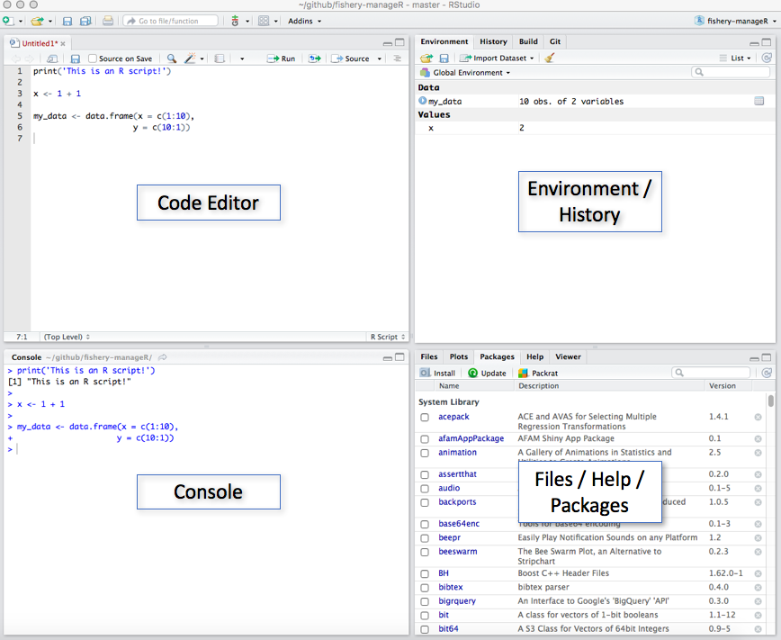
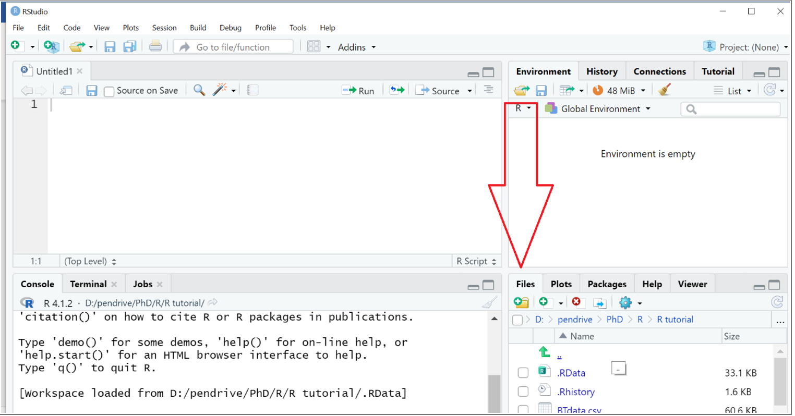

```{r setup, include=FALSE}
knitr::opts_chunk$set(echo = F)
```

## RStudio

RStudio is a **shell** and **programming environment** for the R language. It makes working with R much easier and more intuitive by providing a **user interface** to R features originally hidden behind R functions. However, remember that **all actions can be also performed within the classical R console**.

### Installation

Follow the [link](https://posit.co/download/rstudio-desktop/), choose the appropriate operating system and install free **RStudio Desktop**. Have in mind that **R needs to be installed first**.

### Appearance

RStudio has three great advantages over classical R console:

  - saving and editing your code as a text file (.R)
  - running any piece of previously written code (reanalysis)
  - displaying all R objects and variables saved in your computer memory at any given moment
  
The RStudio window consists of four main panels:



  1. **Code editor** - Here you can write your code and save it in a text file (.R). You can run it anytime by highlighting given piece of code and clicking Run in right-top corner (also Ctrl + Enter).

  2. **Console** - Exactly the same console as in standard R (see Class 1). Note that any line of code run from Code editor will appear in the console. To recall the lastly run line of code use Arrow-up (it works as a general way of browsing through the history of the executed commands).

  3. **Environment / History**  
    -	**Environment** - shows all the objects that you created or loaded into your computer’s memory (RAM). Have in mind they will be lost as soon as you close RStudio.  
    -	**History** - access to the entire code run in a given RStudio session.  
  
  4. **Files / Plots / Help / Packages**  
    -	**Files** - manage files on your computer.  
    -	**Plots** - preview generated plots before saving them.  
    - **Help** - access help page (often with examples) for a given function.  
    - **Packages** - manage all additionally installed packages.
    
#### <span style="color: green">**Exercise 1**</span>
<span style="color: green;">**Create new script file (File >> New File >> R Script) and save it. Call it as you wish. Write code for all subsequent exercises using **Code editor**. Remember that to obtain any outcome/result you need to execute/run your code first.**</span>

To make your code easier to read and understand it is a good practice to **add comments**. Comments help explain what specific sections of the code are doing. This may be useful for other people using your script, and for you as even if you know what your code is doing, after some time you may forget it, and again spend a lot of time to understand its functioning. 

In R you can add comments to your script by **starting the line with hashtag** `#`. Apart from adding comments to your script hashtag can be also used to **"turn off" a chunk of your code**. **Anything to the right of the hashtag will not be taken by R as a command**. To **comment several lines** highlight them and use **Ctrl+Shift+c**. Repeat it to uncomment. When you remove hashtag, the command will be executed when you run your script again.

## Working directory

**Working directory** is a folder on your computer where **R is operating at the moment**. Think about it as a separate room for a given analysis. R will look for and save all files in the working directory by default. You can check current working directory by typing `getwd()`.

### How to set a working directory?  
To set new working directory use Session >> Set Working Directory >> Choose Directory or use `setwd()` function with a destination path provided as an argument.
Unless you continue a previous analysis, ALWAYS set new working directory.

#### <span style="color: green">**Exercise 2**</span>
<span style="color: green;">**Create a new folder and set it as a working directory.**</span>

```{r, eval=F}
setwd("path")
```

>**Curiosity**  
Although it is usually easier to create folders traditionally, using your operating system, have in mind that you can also do it through R by using `dir.create()` function.

<font size = "6">**"So it begins” - Théoden, 3019 TE**</font>


## R / programming workflow

A huge part of preventing mistakes and reducing the amount of frustration in your work is developing good programming habits and having an established order of doing things. Now we will go through some parts of programming workflow.

### Setting up RStudio at the beginning of your working session.

One of the advantages of RStudio is that it can save a lot of your work in between coding sessions. However, this can also generate some problems, as it can be easy to forget what you were doing last time. Having consistent setup rules can help with this.  

**Every time you boot up RStudio, remember to:**  
  -	**create and save a new script file** – if you don’t have one already  
  -	**copy and update the name of your script file (e.g. with that day’s date)** – if you are working on a previously created file and want to keep track of multiple versions  
  -	**set up a working directory** – easiest way to keep track of this is to have a line of code at the beginning of the script; if you set up a working directory through the RStudio user interface, you can copy the code from the console into the script  
  -	**clear the RStudio environment** – this is important especially when switching between scripts/projects you are working on  
  - **load any packages that the script is using** – further explanation of this will be in the section about packages; for now, remember that some functions we will use later on are not present in base R, so if RStudio suddenly doesn’t want to run code with a function that you’ve been using before, it might be because it comes from a package that isn’t currently loaded

### Uploading files into RStudio

There are two main ways of uploading files into the RStudio environment – **by calling a function in your code**, and **through the user interface**. Which one you pick depends on you.
If you want to upload an MS Excel file through the user interface, go to the files section of the screen (lower right square section). Then pick the files tab.



Remember that, **by default, the tab will display the content of your working directory**. You can pick a file that is not in your working directory, however, it is good practice to keep a copy of the files you’re working on in the folder set as your working directory.  

Once you find the file, you can click on it, select “import dataset”, and navigate through the upload process. Through the upload menu, you can setup the name of the file, the sheet in the excel file you want to upload, and the range of data you want to include. R also generates code that you can then copy and include into your R script.* 

Uploading an MS Excel file to R should create an object called a **data frame**, which is basically a table with columns and rows. You can check whether the object you created is a proper data frame by using the `class()` function. 

#### <span style="color: green">**Exercise 3**</span>
<span style="color: green;">**Upload [class_2_data.xlsx](class_2_data.xlsx) file into R using RStudio user interface.**</span>

*Notice that, when you upload your data from an MS Excel file, one of the lines of code that RStudio generated is `library(readxl)`. This is because there is no way in base R to upload .xlsx files – we need an external package.

```{r, eval=F}
library(readxl)
class_2_data <- read_excel("path")
```

### Packages

A package is a collection of functions not available in the base R. Think about it like a toolbox, or an app for your phone that you need to install for a specific function. Some packages are downloaded at the same time as RStudio is installed; others you need to find and download yourself.  

#### Why are some R functions not available in base R?  
For two reasons. Firstly, if every time you opened RStudio it would have to load every single function in it, even the fastest laptop would take many minutes to open R. This is why some packages can be found in RStudio from the moment you install it, but are not loaded (=activated) until you ask RStudio to do it. You can browse a list of packages in the packages tab, in the same lower right corner as the file upload.  

Secondly, the R programming language is a collective non-profit project – thousands of scientists and programmers have contributed to it since it was created. There are many hyper specific packages being introduced every year for very particular research and analysis purposes. This allows people to personalize their R experience and contribute to its development.


#### <span style="color: green">**Exercise 4**</span>
<span style="color: green">**Browse the pre-existing packages in your RStudio. Then try googling or looking up packages for you specific purposes (e.g. by typing “R package for [your purpose]”).**</span>

Remember, if you are using someone else’s package in your research, you need to cite it in your articles the same way as you would someone else’s lab protocol. Usually, when a new package is introduced, a manual is published at the same time, and the appropriate citation is provided in the package instructions.

>**Curiosity**  
Although R was developed primarily for data science and statistics, it can be used for many different purposes. For example, there are some text-based games for R. Check out [these](https://www.r-bloggers.com/2016/06/useless-but-fun-r-packages/) (useless but fun) R packages.

#### How to use a package? 
If the package you want to use is already present in RStudio, all you need to do is load it using the `library()` function. However, if the package is not installed you have to do it and then load with `library()` function. 

#### <span style="color: green;">**Exercise 5**</span>  
<span style="color: green;">**Load any package you can find in the RStudio list using a command prompt library([package name]).**</span>

Remember that every time you close the RStudio app, it turns off any packages you were using (= puts away the toolbox). So every time you close and open the app again, you need to run the `library()` command again.

If the package you want to use is not already in R, you will need to download and install it first. You can do it using a line of code provided by the package creator or the `install.packages()` function. Remember to put the name of the package in **quotation marks** (`""`).  

Once a package is installed, you need to load it. An installed package will remain in R memory for as long as the app itself is not reinstalled. 

#### <span style="color: green;">**Exercise 6**</span>
<span style="color: green;">**Install the tidyverse package using the `install.packages()` function. Once installed, load the package `dplyr`.**</span>

*Advice: the more packages you install, the longer it will take for RStudio to open; it can also slow down the app. For most computers this difference is pretty small, however, if you have an older laptop, it is better not to install every package under the sun.*

#### Coming back to uploading data.

For the sake of keeping data clean and files simple and compatible, it can be a good idea to work on more universal, plain text files than complex .xlsx files: 

  - **.csv** - comma-separated values - rows defined as lines of text, columns separated by commas  
  - **.tsv** - tab-separated values - rows defined as lines of text, columns separated by tab
  
They can be easily uploaded and downloaded from R. Additionally, .csv files are much lighter in “weight”, which can be crucial for working with very large datasets, e.g. output of genetic sequencers, continuous trackers of environmental conditions, or results of laboratory tests.
  
*For Polish speakers: Using Polish versions of some software (e.g. Excel) with default settings of the operating system may generate problems with .csv files as comma is used as decimal delimiter. Excel (in polish) by default creates .csv file with columns separated by semicolon (;). Then, arguments of importing R functions need to be properly adjusted.*

#### <span style="color: green;">**Exercise 7**</span>
<span style="color: green;">**In Excel save the "class_2_data.xlsx" file as a "class_2_data.csv" file. Remember to set it as a “comma separated” file.**</span>

Uploading a .csv file into R does not require any additional package. We can do it using a `read.csv()` or `read.table()` function.
`read.table()` takes one main argument – the name of the file (including the file extension!), **written in quotation marks**. Remember that if this file is not in your working directory, you will need to provide the **absolute path** to it.

Additionally, we need to provide extra arguments to make sure the file is read correctly. 
These arguments are, for example:  

  - **header**: specifies whether the top row should be considered the headers of each column; should set as `TRUE` if the top row corresponds to column descriptors and to `FALSE` if the top row starts immediately from data  
  - **sep**: stands for separator; specifies which symbol (“,”, “_”, or “ “) was used to separate values in the file; by default, .csv files should be comma ( , ) separated, but might be set to something else – you can check by opening the .csv file though a basic text editor  
  - **encoding**: specifies which encoding is used in the .csv file; can be important if you are using files with non-latin characters, for example*, but isn’t always needed

*if you are trying to upload a file with non-latin characters and R is displaying them as nonsense symbols, you can try the following: open your .csv as a text document in the most basic text editor and save it with the **UTF-8** encoding; then, while uploading it to R, make sure to specify encoding as UTF-8; this should fix the problem

The `read.csv()` function can work with just one argument – the file name. However, as the name suggests, it only works with standard .csv file and does not allow for certain kinds of customization through arguments. 

#### <span style="color: green;">**Exercise 8**</span>
<span style="color: green;">**Upload "class_2_data.csv" file into the R environment using the `read.table()` function; you can set the additional arguments as: `header = `TRUE`,  sep = “,” , encoding = “UTF-8”`**

In most of your analyses, you will not need to download a modified data frame out of R – you will only be interested in the results of certain tests or graphs that R will generate. However, if you want to **download the data frame**, you can use:  
  - `write.table()` – for saving a .csv file; uses similar arguments to `read.table()`  
  - `write_xlsx()` – requires the `writexl` package to be installed and loaded

### Searching for functions and code on the internet

R is a constantly growing and updating community. If you need something done in R, chances are, someone has made a library or a function for it.

Tips for finding R solutions on the Internet:

  - **improve your google searches** - identify keywords that will allow you to find the function you need and combine them using quotation marks and Boolean logic (e.g. “R package” AND “general linear model”)  
  - **use trusted sources for finding packages and getting advice** – *[StackOverflow](https://stackoverflow.com/), [RDocumentation](https://www.rdocumentation.org/), [CRAN](https://cran.r-project.org/)*, and published research are the best  
  - **use published codes** - many coders and researchers will share their code for free on GitHub and other websites – even if the code cannot solve your problem, it can point you in the right direction  
  - **be careful with AI-generated solutions**: while websites like ChatGPT can be useful for finding specific functions, it rarely generates a whole block of code that does not require heavy editing; if the code uses functions you don’t know, you might not notice that it generates faulty results

#### <span style="color: green;">**Exercise 9**</span>
<span style="color: green;">**Search the Internet for an R function that can rename columns in a data frame. Install and load a package if necessary. Try using the RStudio manual to figure out how to use the function that can perform this task.**</span>

Remember that the manual for any installed function can be pulled up by typing a question mark (`?`) before its name.  
If you are attempting to use someone else’s code and you need to adapt it for your purposes, consider the following:

  -	before changing anything in the code you copied, go through the entire script and **make sure you understand**, at least on a basic level, what every line is doing  
  -	remember to change the parts of the code that do not apply to your tasks: e.g., change the path to files being used, adjust function arguments and parameters, and remove parts that are not important for you  
  -	another coder might assume that everyone uses the same packages as they do – if a function is not working, it can be a result of R not recognizing it  
  -	you can find what package uses a specific function by searching **“R [function name] package”** – keep in mind that multiple packages can use the same word to describe different functions, so make sure to read its description before downloading the package  


#### <span style="color: green;">**Exercise 10**</span>
<span style="color: green;">**Find a script online that uses R to calculate time differences between two dates. Try adjusting it to calculate how many days are left in this year.**</span>

```{r, eval = F}
difftime("2020-12-31", "2020-10-06", units = "days") 
```


### Reading warning and error messages.

It is likely that you will encounter warning messages and error messages on a daily basis while using R. This does not mean you are careless or bad at coding – errors and warnings exist to guide you in the process of using R. Because computers are very particular about details and can be unintuitive for us, it takes effort to understand them. Knowing how to react to errors is a big component of effective coding workflow.  

Whenever RStudio finds an issue in the code, it will display a message in the console. When in doubt, you can always copy the message and paste it into google search.

### Warnings vs Errors

**Warning messages** are alerts from R about things that it considers potentially problematic, but that **do not prevent the code from running**. This can happen if running the code introduces changes to files that R wants to alert you about, or when there are conflicts between certain functions, or when R detects unused bits in your code.

Some common warning messages are:

  -	<span style="color: red">**NAs introduced by coercion**</span> – often happens when converting between data types, e.g. numeric to character; if R fails to do this for whatever reason, it will insert an NA value instead, and warn you about this change  
  -	<span style="color: red">**unused argument**</span> – happens when R notices that some argument in a function or a whole line of code does not do anything; this is not necessarily an issue, but might mean that something you intended to work is not actually working  
  -	<span style="color: red">**non-numeric argument to binary operator**</span> – most likely means you are trying to perform a mathematical operation (addition, multiplication, etc) on something that is not a number; remember that something can look like a number in a vector or a data frame but still be seen as a character
  
Some warning messages can be safely ignored, while some indicate potential issues in your code. When in doubt, always double check on the internet.

**Errors** are issues in the code that actually **prevent the code from running**. If you are attempting to run a whole script, **the error message will show up on the console immediately after the line that caused the issue, and the code will not run past it**. If you are unsure exactly what function is causing the issue, you can run the code line by line until it will stop working.

Note: a message with the same content can be either a warning or an error. The difference is in how it affects the code – if the operation was still executed, it is a warning. If the operation failed, it is an error.  

Some common causes for errors in R can be:

  -	<span style="color: red">**Error in [code]: object not found**</span> - you are trying to perform an operation on an object that does not exist; this can happen because your file did not load into R (e.g. because the working directory is set incorrectly), because of a typo in the object’s name (remember that names in R are case-sensitive!) or because the object was deleted from the environment  
  -	<span style="color: red">**Error: unexpected '[symbol]' in "[code]**”</span> – there is some sort of syntax issue, e.g. a typo in the function, a misplaced comma, or missing parentheses   
  -	<span style="color: red">**Error in [function()]: could not find function “function()”**</span> – either the function name is misspelled or you are trying to use a function from a package that isn’t installed or loaded; can also happen with old code when the name of a function updates – in this case, RStudio will sometimes suggest the new name, otherwise it can be found on the internet  
  -	<span style="color: red">**Error in [data frame]: arguments imply differing number of rows**</span> – you are trying to create a data frame using vectors of different length or combine dataframes of different sizes

The order of operations when encountering an error:

1)	Do not panic  
2)	Identify what line of code is causing the error  
3)	Identify what kind of error it is  
4)	Check for the most obvious issues as outlined above  

If all of the above fails, you can try looking up your specific situation – chances are, someone else had the exact same issue and posted it on *Reddit* or *StackOverflow* where someone else has already explained how to fix it.

#### <span style="color: green;">**Exercise 11**</span>
<span style="color: green">**Look at these lines of code. What kind of errors do you think they contain? Run the lines of code separately, then identify what error is occurring and why. If you know how to fix the issue, edit the code.**</span>

- Example One: Finding The Log of a Number  
`lg(10) `

- Example Two: Multiplying A Vector by a Number  
`vect <- c(1, 2, 'three')`  
`vect * 5`

- Example Three: Basic Statistical Description of a Data Frame  
`describe(class_2_data)`

### Keeping your code clean and tidy

As you can see, coding can be meticulous and sometimes frustrating work. To reduce this frustration, remember the following:

  -	stick to habits of **setting up your working session** every time you open RStudio  
  -	if you are working on a script for multiple days, consider making a **new copy of it every day or every week** to keep previous versions in hand in case you will need to revert the changes
  -	**include comments** in your code! remember that you can use the hashtag symbol `#` to both turn off certain parts of the code and leave useful descriptions – this can be a lifesaver when using someone else’s code or even coming back to work you were doing weeks or months ago  
  -	make it a habit to go back through your scripts and **simplify anything you can** - the shorter the script, the less can go wrong  
  -	give your objects **short, unique, and self-describing names** - things can quickly get out of hand if all of your data frames are called “dataframe”  
  -	make use of packages such as `dplyr` to make your files more tidy – we will learn more about it during the next lesson

## <span style="color: darkorange;">Homework</span>

<span style="color: darkorange">
  1.	Create a new script file and save it as “class_2_homework_Your_Name.R”. Create a separate folder on your computer and set that folder as your working directory. **Include the code for setting up that directory at the beginning of your script**.<br> 
  2.	Upload the [homework_data.xlsx](homework_data.xlsx) file into the RStudio using your preferred method. **Include the code for uploading the file into the script**. Remember that some upload methods require packages to be loaded first.<br>
  3.	Load the `dplyr` package. **Include the loading of the package as a line of code in your script**.<br>
  4.	Find a `dplyr` function that can sort a data frame based on the value of the given column of a data frame. Use it to sort homework data frame the values in the column `score` from lowest to highest.<br>
  5.	Save your result as a .csv file using `write.table()` function. Call the .csv file “class_2_sorted_column_Your_Name.csv”. Check `write.table()` function manual to find out what arguments you should use to save .csv file properly.

<span style="color: darkorange">**Upload both your R script and .csv file to the "Class 2" tab on *Pegaz* platform.**</span>

```{r, include = FALSE, eval= FALSE}
print("Ex. 1")
#setwd("path/to/instructions/class 2")

print("Ex. 2")
library(readxl)
homework_data <- read_excel("homework_data.xlsx")

print("Ex. 3")
library(dplyr)

print("Ex. 4")
homework_data <- arrange(homework_data, score)

print("Ex. 5")
write.table(homework_data, "Class_2_sorted_column_Your_Name.csv", sep = ",", row.names = FALSE, col.names = TRUE)
```

