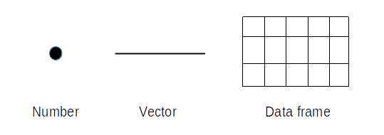

```{r setup, include=FALSE}
knitr::opts_chunk$set(echo = F)
```
**Data wrangling** refers to the process of **transforming raw and basic data into a more useful, neat, and tidy form**. It includes everything from modifying the appearance of tables and organizing their contents to performing mathematical operations on the data and preparing it for various types of statistical analysis. In the first part, we will cover the data wrangling capabilities of **base R**.

## Data frame



**A data frame** is something you probably know as a “table”. However, it has some unique characteristics:

  1. **It always has a header**. It means that each column must have its unique name. If names are not provided, R creates them automatically as **"V"** (as “variable”) followed by the consecutive number.  
  2.	**The table is always complete**. It means that each column has the same number of rows. If some data are missing, R puts `NA` (“not available”) in a given cell.  
  3.	An individual column of a data frame, similarly to vectors, can contain **only one type of data**, but **different columns can be of different types**.  
  
During most statistical analyses, you will be operating on data frames.

>**Curiosity**  
In R, there is also an object called a **matrix** that will not be covered during this course. It looks and behaves similarly to the data frame, but all cells must contain the same type of data (often numbers). It is usually used in mathematics (matrix operations) and graphics (image encoding).  
Recently, the object called **tibble** is rising in popularity and possibly will replace data.frame in the near future. The differences between them are rather subtle and do not affect our exercises directly. If you want to read more, follow the [link](https://blog.rstudio.com/2016/03/24/tibble-1-0-0/).

In the last class, we learned how to upload an existing file into R. Now we will learn how to modify data frames.
Remember the optimal coding workflow.

**Another good habit to add to the ones we learned last time is inspecting your data once it is uploaded into RStudio. You can do this in the following ways:**

  •	**visually inspect the file** by either clicking on it in the environment (top right square) or by using the `View(dataframe)` function – reminder that R is case sensitive and View starts with a capital V  
  •	ask R to **display the top six rows** of the data frame using the `head()` function, or the bottom six rows using the `tail()` function  
  •	get a **brief description** of the data frame using the `summary()` function – this is particularly important, as it displays the type of data in each column of the data frame

### <span style="color: green">**Exercise 1**</span>
<span style="color: green">**Upload [class_3_data.xlsx](class_3_data.xlsx) into R and save it to a variable called `my_data`.**</span>


```{r, eval = T, include = F}
library(readxl)
my_data <- read_excel("class_3_data.xlsx")
```

### <span style="color: green">**Exercise 2**</span>
<span style="color: green">**View the uploaded data frame. Access the `head()` function manual. View the top 10 rows of `my_data` data frame and generate a short description for it.**</span>
 
```{r, eval=F}
head(my_data, n = 10)
summary(my_data)
``` 
 
## Types of data

**All values inside one column must be of the same data type**, but the **columns can be of different types**. The type of data within a column is defined by its class. The most popular classes are:

  •	`character` - strings (remember that numbers surrounded by quotation marks are also treated as strings)  
  •	`factor` - usually strings, represent categorical variables - variables that can take on a limited number of distinct values. When creating or saving data (`data.frame()` or `read.csv()`), you can control whether character vectors are automatically converted into factors using the `stringAsFactors` argument (for R version >= 4.0.0)  
  •	`numeric` - real numbers  
  •	`integer` - only integers  
  •	`logical` - logical values (`TRUE` or `FALSE`)
  
You can check the **class of a value or a vector** using the `class()` function. To use it on a data frame, you need to specify which columns you want to check. To check every column in a data frame, use the `str()` function. 

### <span style="color: green">**Exercise 3**</span>
<span style="color: green">**Check the class of every column of the `my_data` data frame.**</span>

```{r, eval=F}
str(my_data)
``` 

You can also **convert** different data types with the use of as.[class_name] functions family e.g. `as.character()`, `as.factor()` ect.. Note, however, that **not all conversions are permitted** e.g., a letter cannot be converted into an integer. To change the class of a column, you need to replace the whole column with the result of an `as.[class_name]` function. We will learn how to do it once we discuss subsetting.

## Subsetting

A data frame can be **subsetted** (=accessed or displayed in a specific way) with the use of **coordinates** (indexes) enclosed within the **square brackets** (`[]`). In case of data frames, there are always 2 coordinates: `table[row_number, column_number]`.

Note that **vectors have only one coordinate**, the position, so they can be called one-dimensional objects. **Data frames have two dimensions**: rows and columns.

### <span style="color: green">**Exercise 4**</span>
<span style="color: green">**Return the value from the 5th row and 3rd column of `my_data`.**</span>

Expected result:

```{r}
my_data[5, 3]
```

You can call for **multiple values in the same time**. To define a range of coordinates, use a **colon** (`:`) separating range borders - e.g., `table[row_number_1:row_number_2, column_number]`.

### <span style="color: green">**Exercise 5**</span>
<span style="color: green">**Return first 5 rows for the last 2 columns of `my_data`.**</span>

Expected result:

```{r}
my_data[1:5, 3:4]
```


### <span style="color: green">**Exercise 6**</span>
<span style="color: green">**Now, save the 4th column of `my_data` as a variable called `my_column_4`. Call the variable, so its content is displayed in the console.**</span>

*Tip: If you want to call for **all rows or columns**, it is enough to leave blank space instead of the respective coordinate - e.g., **`table[,column_number]`.***

Expected result (first 10 rows):

```{r}
my_column_4 <- my_data[, 4]
my_column_4
```


### <span style="color: green">**Exercise 7**</span>
<span style="color: green">**Return the 3rd, 4th, and the 5th value from the variable `my_column_4`.**</span>

Expected result:

```{r}
my_column_4[3:5, 1]
```

The table can also be subsetted with the use of columns’ (or rows’) names.

### <span style="color: green">**Exercise 8**</span>
<span style="color: green">**Return the 4th column of `my_data`, but use the column name instead of its number. Don’t forget about quotation marks (`""`).**</span>

Expected results (first 10 rows):

```{r}
my_data[, "score"]
```

Another way to obtain the **whole column** is to use the **dollar sign `$` between the table’s and column’s names**. Such an expression is automatically treated as a vector, so it can be directly subsetted to get a particular row. - e.g. `table$column_name[row_number]`.

### <span style="color: green">**Exercise 9**</span>
<span style="color: green">**Return values from the 5th to the 15th row of the mass column from `my_data`. Use the dollar sign `$`.**</span>

Expected result:

```{r}
my_data$mass[5:15]
```

If desired rows (or columns) **do not follow each other** and the range option cannot be used, a **vector of coordinates** should be provided.

Note that **the outcome is no longer a table**. As we asked for just one column, a series of numbers (vector) was returned.

> **Curiosity**  
Pulling one row from the data frame **will not result in a vector**. It is because a row can contain elements of different types, which is not allowed for vectors.

### <span style="color: green">**Exercise 10**</span>
<span style="color: green">**Create a vector with values 3, 5, 7, 9, and 12 and save it to a variable. Call it.**</span>

Expected result:

```{r}
v <- c(3, 5, 7, 9, 12)
v
```

### <span style="color: green">**Exercise 11**</span>
<span style="color: green">**Return rows of the `score` column corresponding to the values in the vector created before.**</span>

Expected result:

```{r}
my_data$score[v]
```

You can also **subset everything except specified columns (or rows)**. To do this, put a minus (`-`) before an index or a vector of indices.

### <span style="color: green">**Exercise 12**</span>
<span style="color: green">**Return all columns of `my_data` except the 2nd one.**</span>

Expected result (first 10 rows):

```{r}
my_data[, -2]
```


## Simple operations on data frames/ tibbles

###     1.	Replacement

To replace a given value in your table assign a new value to this place in your table with the use of an arrow (`<-`). It works just as with variables assignment - e.g.` table[row_number,column_number] <- new_value`

#### <span style="color: green">**Exercise 13**</span>
<span style="color: green">**Replace the 5th value in the column `sex` with the label ‘Unknown’. Call column `sex` and check whether it was indeed replaced.**</span>

Expected result: 

```{r}
my_data$sex[5] <- "Unknown"
my_data$sex
```

###   2.	Mathematical operations

You can use classical mathematical operators: `+`, `-`, `*`, and `/`. Remember, however, that **mathematical operations make sense only for integer or numeric** data types.

#### <span style="color: green">**Exercise 14**</span>
<span style="color: green">**Recalculate and modify the `mass` column to convert it from kilograms to pounds (1 kilogram equals around 2.20 pounds). Display modified column.**</span>

Expected result:

```{r}
my_data$mass <- (my_data$mass) * 2.20
my_data$mass
```
You can also use simple summary functions from the previous class (see Class 2).

#### <span style="color: green">**Exercise 15**</span>
<span style="color: green">**Calculate the mean value of the `score` column.**</span>

Expected result:

```{r}
mean(my_data$score)
```

###   3.	Simple summaries 

  •	`nrow()` - number of rows  
  •	`ncol()` - number of columns  
  • `dim()` - dimensions of an object
  
#### <span style="color: green">**Exercise 16**</span>
<span style="color: green">**Return the total number of cells within `my_data`.**</span>

Expected result:

```{r}
nrow(my_data)*ncol(my_data)
```
###   4.	Deleting rows with missing data

**Missing data**, as stated before, are represented as `NA` (not available) in R. Most of the functions will raise an error every time the `NA` is provided as the argument.

#### <span style="color: green">**Exercise 17**</span>
<span style="color: green">**Choose one cell and replace its value with `NA`. Do not add quotation marks as `NA` is an internal R symbol (just as `π`). Print the whole row.**</span>

```{r, echo = F}
my_data[1, 2] <- NA
```

Rows with missing data can be removed with the `na.omit()` function. To save changes, the result of the `na.omit()` function must be saved as a variable. **Note that, in practice, deleting missing data must be well justified. Make sure they do not provide any important information**.

#### <span style="color: green">**Exercise 18**</span>
<span style="color: green">**Check the number of rows of `my_data`. Remove the row with missing data. Replace variable `my_data` with the modified table. Remember that it cannot be undone. Check if the number of rows has changed.**</span>

```{r}
my_data <- na.omit(my_data)
```
## Adding a new column or row

1.	Adding a new column is relatively simple. All you need is a vector. However, remember three things:
  
    -	**The length of the vector must equal the number of rows of a data frame**  
    -	**The order of values within a vector corresponds to the row numbers**  
    -	**The name of the vector will become the name of the added column**
    
We are going to add a column with the IDs of observations. Note that a column with IDs is often necessary in statistical analysis. It is also inherent to the [data in long format](https://www.theanalysisfactor.com/wide-and-long-data/), which is strongly advised.

### <span style="color: green">**Exercise 19**</span>
<span style="color: green">**Create a vector with ID numbers starting from 100. Use one of the functions introduced above to obtain the desired length of the vector. Call the vector ID.**</span>

Expected result:

```{r}
ID <- c(100:(99 + nrow(my_data)))
ID
```

You can combine data frames with the use of the `cbind()` function in the following manner: `cbind(data_frame1,data_frame2)`. Note that a **vector can be seen as a data frame with only one column**.

### <span style="color: green">**Exercise 20**</span>
<span style="color: green">**Add generated IDs as the first column in `my_data` dataframe. Overwrite the `my_data` variable.**</span>

```{r}
my_data <- cbind(ID, my_data)
```

2.	Adding a new row is more complicated as **you cannot create a vector with different types of data**. Firstly, you need to create a new data frame (similar to the old one) consisting of only new row (or rows). To do this, use the `data.frame()` function in the following manner: `data.frame(columnName1 = value1, columnName2 = value2,…)`.
  
### <span style="color: green">**Exercise 21**</span>
<span style="color: green">**Create a data frame `added_rows`, with one row and the following values: `130`, `ind031`, `F`, `55.7`, `77`. Columns’ names should correspond to those of `my_data` data frame. Call it.**</span>

Expected result:

```{r} 
added_rows <- data.frame("ID" = 130, "individual" = "ind031", sex = "F", "mass" = 55.7, "score" = 77)
added_rows
```


>**Curiosity** 
To combine a data frame with more rows at the same time, replace the values for each column with the **vectors**.

To stick data frames by rows use the `rbind()` function in the following manner: `rbind(data_frame1, data_frame2)`

### <span style="color: green">**Exercise 22**</span>
<span style="color: green">**Add generated row at the end of `my_data` dataframe. Overwrite the `my_data` variable. Print the last 6 rows of `my_data` to check the operation result.**</span>

Expected result:

```{r}
my_data <- rbind(my_data, added_rows)
tail(my_data)
```

Sometimes we need to change the **class** of a column in a dataframe. This can be done using `as.[class]` functions: `as.numeric()`, `as.character()`, `as.factor()`, etc.

### <span style="color: green">**Exercise 23**</span>
<span style="color: green">**Use the class() function to check the data type of the sex column in my_data. Then, convert this column into a factor and overwrite it. Finally, use class() again to confirm the conversion.**</span>

Expected result:

```{r}
class(my_data$sex)
```
```{r}
my_data$sex <- as.factor(my_data$sex)
class(my_data$sex)
```

## Saving the data frame

To save your data frame into a file, use the `write.table()` function.

### <span style="color: green">**Exercise 24**</span>
<span style="color: green">**Save modified `my_data` to the .csv file.**</span>

## <span style="color: #da205eff;">Homework</span>

<span style="color: #da205eff">
Prepare your homework in the form of a script file (.R) and call it "class_3_homework_Your_name.R".  
Perform all exercises using the built-in ToothGrowth dataset. You can view details about the dataset with `?ToothGrowth`. To begin, assign it to a variable with `my_data <- ToothGrowth`, and then carry out all operations on `my_data` as we did in today's class.  
Include all subsequent steps in a script file.<br>
  1.	Check the class of each column in the `my_data` data frame. Find the shortest tooth length.<br>
  2.	Add a new row at the end of `my_data`. The values in a new row should be as follows: 26.2, OJ, 2.0. Write the modified `my_data` dataset as the `my_data_modified` variable. The `my_data` should still contain the original dataset.<br>
  3.	Add column with IDs - "obs_1" to "obs_n" ("n" is the number of the last observation)- for each observation as the first column of `my_data_modified`. Overwrite `my_data_modified` variable. Tip: to create a vector with IDs, you can use `paste()` to connect "obs_" with the numbers (1-n) instead of typing each ID manually.<br>
  4.	Modify `my_data_modified` by removing its first 4 rows. Overwrite the `my_data_modified` variable.<br>
  5.	Save a modified dataset to a "class_3_toothgrowth_modified_Your_Name.csv" file.<br>

<span style="color: #da205eff">**Upload your R script to the "Class 3" tab on the *Pegaz* platform.**</span>
