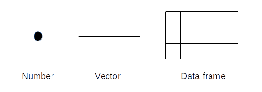

Introduction to R - class 3  Data Wrangling
1
================
Tomasz Gaczorek, Wiesław Babik & Mateusz Chechetkin Marzena
Marszałek  <marzena.marszalek@doctoral.uj.edu.pl> 
2024-10-01

- [Data frame](#data-frame)
  - [**Exercise 1**](#exercise-1)
  - [**Exercise 2**](#exercise-2)
- [Types of data](#types-of-data)
  - [**Exercise 3**](#exercise-3)
- [Subsetting](#subsetting)
  - [**Exercise 4**](#exercise-4)
  - [**Exercise 5**](#exercise-5)
  - [**Exercise 6**](#exercise-6)
  - [**Exercise 7**](#exercise-7)
  - [**Exercise 8**](#exercise-8)
  - [**Exercise 9**](#exercise-9)
  - [**Exercise 10**](#exercise-10)
  - [**Exercise 11**](#exercise-11)
  - [**Exercise 12**](#exercise-12)
- [Simple operations on data frames/
  tibbles](#simple-operations-on-data-frames-tibbles)
  - [1. Replacement](#1-replacement)
    - [**Exercise 13**](#exercise-13)
  - [2. Mathematical operations](#2-mathematical-operations)
    - [**Exercise 14**](#exercise-14)
    - [**Exercise 15**](#exercise-15)
  - [3. Simple summaries](#3-simple-summaries)
    - [**Exercise 16**](#exercise-16)
  - [4. Deleting rows with missing
    data](#4-deleting-rows-with-missing-data)
    - [**Exercise 17**](#exercise-17)
    - [**Exercise 18**](#exercise-18)
- [Adding new column or row](#adding-new-column-or-row)
  - [**Exercise 19**](#exercise-19)
  - [**Exercise 20**](#exercise-20)
  - [**Exercise 21**](#exercise-21)
  - [**Exercise 22**](#exercise-22)
  - [**Exercise 23**](#exercise-23)
- [Saving data frame](#saving-data-frame)
  - [**Exercise 23**](#exercise-23-1)
- [Homework](#homework)

Data wrangling refers to the process of **transforming raw and basic
data into a more useful, neat, and tidy form**. It includes everything
from changing the appearance of tables and sorting their contents to
making mathematical operations on the data and preparing it for various
kinds of statistical analysis. In the first part, we will cover the data
wrangling capabilities of base R.

## Data frame

Data frame is something you probably know as a “table”. However it has
some unique characteristics:  
1. **It always has a header**. It means that each column must have its
unique name. If names are not provided R creates them automatically as
**V** (as “variable”) followed by the consecutive number.  
2. **Table is always complete**. It means that each column has the same
number of rows. If some data are missing R puts `NA` (“not available”)
in a given cell.  
3. An individual column of a data frame, similarly to vectors, can
contain **only one type of data**, but **different columns can be of
different types**.

During most statistical analysis, you will be operating on data frames.

> **Curiosity**  
> In R, there is also an object called matrix that will not be covered
> during this course. It looks and behaves similar to the data frame but
> all cells must contains the same type of data (often numbers). It is
> usually used in mathematics (matrix operations) and graphics (image
> encoding).  
> Recently, the object called tibble is rising in popularity and
> possibly will replace data.frame in the near future. The differences
> between both are rather subtle and do not affect our exercises
> directly. If you want to read more, follow the
> [link](https://blog.rstudio.com/2016/03/24/tibble-1-0-0/).

In the last class, we learned how to upload an existing file into R. Now
we will learn how to modify data frames. Remember about the optimal
coding workflow.

**Another good habit to add to the ones we learned last time is checking
your data once it is uploaded into the RStudio. You can do this in the
following ways:**

• visually inspect the file by either clicking on it in the environment
(top right square) or by using the View(dataframe) function – reminder
that R is case sensitive and View starts with a capital V  
• ask R to display the top five rows of the data frame using the
`head()` function, or the bottom 5 rows using the `tail()` function  
• get a brief description of the data frame using the `summary()`
function – this is particularly important, as it displays the type of
data in each column of the data frame

### **Exercise 1**

**Upload
[class_3_data.xlsx](class_3_data.xlsx) into R and save it to a variable
called `my_data`.**

### **Exercise 2**

**View the uploaded data frame. View the top
five rows of `my_data` data frame and generate a short description for
it.**

## Types of data

All values inside one column must be of the same data type, but the
columns can be of different types. Type of data within a column is
defined by its class. The most popular classes are:

• `character` - strings (remember that numbers surrounded by quotation
marks are also treated as strings)  
• `factor` - strings with the levels carrying information about the
number of occurrences and order of strings. Factors are commonly used
when doing statistics in R, where they serve as indicators of the
nominal scale. To read strings as factors set the `stringAsFactors`
argument of importing function to `TRUE` (for R version \>= 4.0.0).  
• `numeric` - real numbers  
• `integer` - only integers  
• `logical` - logical values (`TRUE` or `FALSE`)

You can check the class of a value or a vector using the `class()`
function. To use it on a data frame, you need to specify which columns
you want to check. To check every column in a data frame, use the
`str()` function.

### **Exercise 3**

**Check the class types of every column of
the `my_data` data frame.**

You can also convert different data types with the use of as… functions
family e.g. `as.character()`, `as.factor()` ect.. Note, however, that
not all conversions are permitted e.g. a letter cannot be converted into
an integer. To change class of a column you need to replace whole column
with the result of as… function. We will learn how to do it once we
discuss subsetting.

## Subsetting

Data frame can be **subsetted** (=accessed or displayed in a specific
way) with the use of **coordinates** (indexes) enclosed within the
**square brackets**. In case of data frames there are always 2
coordinates: `[row_number, column_number]`.

Note that **vectors have only one coordinate**, the position, so they
can be called one-dimensional objects. **Data frames have two
dimensions**: rows and columns.

### **Exercise 4**

**Return the value from 5th row and 3rd
column of `my_data`.**

Expected result:

    ## # A tibble: 1 × 1
    ##    mass
    ##   <dbl>
    ## 1    24

You can call for multiple values in the same time. To define range of
coordinates, use **colon** separating range borders -
e.g. `[row_number_1:row_number_2, column_number]`.

### **Exercise 5**

**Return first 5 rows for the last 2 columns
of `my_data`.**

Expected result:

    ## # A tibble: 5 × 2
    ##    mass score
    ##   <dbl> <dbl>
    ## 1    22    94
    ## 2    29    79
    ## 3    22    88
    ## 4    29    86
    ## 5    24    28

*Tip: If you want to call for all rows or columns it is enough to leave
blank space instead of the respective coordinate -
e.g. **`[,column_number]`***

### **Exercise 6**

**Now, save 4th column of `my_data` as a
variable called `my_column_4`. Call the variable, so its content is
displayed in console.**

Expected result (first 10 rows):

    ## # A tibble: 30 × 1
    ##    score
    ##    <dbl>
    ##  1    94
    ##  2    79
    ##  3    88
    ##  4    86
    ##  5    28
    ##  6    22
    ##  7    32
    ##  8    36
    ##  9    76
    ## 10    74
    ## # ℹ 20 more rows

### **Exercise 7**

**Return 3rd, 4th and 5th value from variable
`my_column_4`.**

Expected result:

    ## # A tibble: 3 × 1
    ##   score
    ##   <dbl>
    ## 1    88
    ## 2    86
    ## 3    28

Table can be also subsetted with the use of columns’ (or rows’) names.

### **Exercise 8**

**Return the same column (4th) but use column
name instead of its number. Don’t forget about quotation marks.**

Expected results (first 10 rows):

    ## # A tibble: 30 × 1
    ##    score
    ##    <dbl>
    ##  1    94
    ##  2    79
    ##  3    88
    ##  4    86
    ##  5    28
    ##  6    22
    ##  7    32
    ##  8    36
    ##  9    76
    ## 10    74
    ## # ℹ 20 more rows

One another way to obtain the whole column is to use **dollar sign**
between table’s and column’s name. Such expression is automatically
treated as a vector, so it can be directly subsetted to get a particular
row. - e.g. `table$column_name[row_number]`.

### **Exercise 9**

**Return values from 5th to 15th row of mass
column from `my_data`. Use dollar sign.**

Expected result:

    ##  [1] 24 27 22 20 25 24 28 25 20 23 29

If desired rows (or columns) do not follow each other and the range
option cannot be used, vector of coordinates should be provided.

Note that the outcome is no longer a table. As we asked for just one
column, a series of numbers (vector) was returned.

> **Curiosity** Pulling one row from the data frame **will not result in
> a vector**. It is because a row can contain elements of different
> types what is not allowed for vectors.

### **Exercise 10**

**Create a vector with values 3, 5, 7, 9 and
12 and save it to a variable. Call it.**

Expected result:

    ## [1]  3  5  7  9 12

### **Exercise 11**

**Return rows of `score` column corresponding
to values in the vector created before.**

Expected result:

    ## [1] 88 28 32 76 49

You can also subset everything except specified columns (or rows). To do
this, put minus (`-`) before an index or vector of indexes.

### **Exercise 12**

**Return all columns of `my_data` except the
2nd one.**

Expected result (first 10 rows):

    ## # A tibble: 30 × 3
    ##    individual  mass score
    ##    <chr>      <dbl> <dbl>
    ##  1 ind001        22    94
    ##  2 ind002        29    79
    ##  3 ind003        22    88
    ##  4 ind004        29    86
    ##  5 ind005        24    28
    ##  6 ind006        27    22
    ##  7 ind007        22    32
    ##  8 ind008        20    36
    ##  9 ind009        25    76
    ## 10 ind010        24    74
    ## # ℹ 20 more rows

## Simple operations on data frames/ tibbles

### 1. Replacement

Assign a given value to specific place in your table with the use of an
arrow. It works just as with variables assignment -
e.g.`table[row_number,collumn_number] <- new_value`

#### **Exercise 13**

**Replace 5th value in the column `sex` with
the label ‘Unknown’. Call column `sex` and check whether it was indeed
replaced.**

Expected result:

    ##  [1] "M"       "M"       "M"       "M"       "Unknown" "M"       "M"      
    ##  [8] "M"       "M"       "M"       "M"       "M"       "M"       "M"      
    ## [15] "M"       "F"       "F"       "F"       "F"       "F"       "F"      
    ## [22] "F"       "F"       "F"       "F"       "F"       "F"       "F"      
    ## [29] "F"       "F"

### 2. Mathematical operations

You can use classical mathematical operators: `+`, `-`, `*` and `/`.
Remember, however, that mathematical operations make sense only for
**integer or numeric** data type.

#### **Exercise 14**

**Recalculate and modify `mass` column to
convert it from kilograms to pounds (1 kilogram equals around 2.20
pounds). Display modified column.**

Expected result:

    ##  [1] 48.4 63.8 48.4 63.8 52.8 59.4 48.4 44.0 55.0 52.8 61.6 55.0 44.0 50.6 63.8
    ## [16] 61.6 57.2 48.4 46.2 57.2 50.6 68.2 59.4 59.4 74.8 72.6 55.0 46.2 39.6 74.8

Also, you can use simple summary functions from previous class (see
Class 1).

#### **Exercise 15**

**Calculate the mean value of the `score`
column.**

Expected result:

    ## [1] 57.53333

### 3. Simple summaries

• `nrow()` - number of rows  
• `ncol()` - number of columns

#### **Exercise 16**

**Return total number of cells within
`my_data`.**

Expected result:

    ## [1] 120

### 4. Deleting rows with missing data

Missing data, as stated before, are represented as `NA` (not-available)
in R. Most of the functions will raise an error every time the `NA` is
provided as the argument.

#### **Exercise 17**

**Choose one cell and replace its value with
`NA`. Do not add quotation marks as `NA` is an internal R symbol (just
as `π`). Print whole row.**

Rows with missing data can be removed with `na.omit()` function. To save
changes, the result of `na.omit()` function must be saved as a variable.
**Note that, in practice, deleting missing data must be well justified.
Make sure they do not provide any important information**.

#### **Exercise 18**

**Check the number of rows of `my_data`.
Remove the row with missing data. Replace variable `my_data` with
modified table. Remember that it cannot be undone. Check if the number
of rows have changed.**

## Adding new column or row

1.  Adding new column is relatively simple. All you need to have is a
    vector. However, remember three things:

    - **length of vector must equal the number of rows of a data
      frame**  
    - **order of values within a vector corresponds to the row
      numbers**  
    - **name of vector will become name of the added column**

We are going to add a column with IDs of observations. Note that column
with IDs is often necessary in statistical analysis. It is also inherent
to the [data in long
format](https://www.theanalysisfactor.com/wide-and-long-data/) which is
strongly advised.

### **Exercise 19**

**Create a vector with ID numbers starting
from 100. Use one of functions introduced above to obtain the desired
length of the vector. Call the vector ID.**

Expected result:

    ##  [1] 100 101 102 103 104 105 106 107 108 109 110 111 112 113 114 115 116 117 118
    ## [20] 119 120 121 122 123 124 125 126 127 128

You can combine data frames with the use of `cbind()` function in the
following manner: `cbind(data_frame1,data_frame2)`. Note that a vector
can be seen as a data frame with only one column.

### **Exercise 20**

**Place created IDs at the beginning of
`my_data` (as first column). Overwrite my_data variable.**

2.  Adding new row is more complicated as **you cannot create a vector
    with different types of data**. Firstly you need to create a new
    data frame (similar to the old one) consisting of only new row (or
    rows). To do this use `data.frame()` function in the following
    manner: `data.frame(columnName1 = value1, columnName2 = value2,…)`.

### **Exercise 21**

**Create data frame `added_rows` with one row
and following values: `130`,`ind031`,`F`, `55.7`, `77`. Columns’ names
should correspond to this of `my_data`. Call it.**

Expected result:

    ##    ID individual sex mass score
    ## 1 130     ind031   F 55.7    77

> **Curiosity** To combine a data frame with more rows at the same time
> replace the values for each column with the vectors.

To stick data frames by rows use `rbind()` function in the following
manner: `rbind(data_frame1,data_frame2)`

### **Exercise 22**

**Place created row at the end of `my_data`.
Overwrite my_data variable. Print 5 last rows of `my_data` to check the
operation result.**

Expected result:

    ##     ID individual sex mass score
    ## 25 124     ind026   F 72.6    83
    ## 26 125     ind027   F 55.0    42
    ## 27 126     ind028   F 46.2    48
    ## 28 127     ind029   F 39.6    37
    ## 29 128     ind030   F 74.8    48
    ## 30 130     ind031   F 55.7    77

Sometimes we need to change the **class** of a column in a dataframe.
This can be done using `as.[class]` functions: `as.numeric()`,
`as.character()`, `as.factor()`, etc.

### **Exercise 23**

**Check the class of the column sex in
`my_data` using the `class()` function. Now, override that and convert
the column into a `factor` column. Check its type again to confirm the
operation worked.**

Expected result:

    ## [1] "character"

    ## [1] "factor"

## Saving data frame

To save your data frame into a file use `write.table()` function.

### **Exercise 23**

**Save modified `my_data` to the .csv file.
Include your surname in the file name.**\</span.

## Homework

 Prepare your homework in the form of a
script file (.R) and call it “class_3_homework_Your_name.R”.  
All exercises need to be performed on the **built-in `swiss` dataset**.
To work on it, use this command:  
`my_data <- swiss` Include all subsequent steps in a script file.  1.
With an R command, return the lowest percentage of Catholics.  2.
With an R command, return the median percentage of live births living
more than 1 year. Tip: check `swiss` dataset description for column
details.  3. With an R command, add column with self-chosen ID for
each observation and save the dataset as a `my_data` variable. Add `ID`
before `Fertility` column.  4. With an R command, modify `my_data` by
removing its 4 first rows.  5. Save a modified dataset to a .csv
file 

**Upload both your R script and .csv to
the “Class 3” tab on *Pegaz* platform.**
