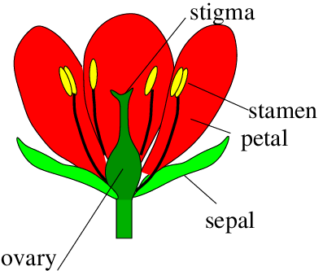

```{r setup, include=FALSE}
knitr::opts_chunk$set(echo = FALSE)
```

**Data visualization** is a vital tool for statistics and research. Plots, graphs, and other visual representations of data not only make complex datasets **more accessible** but also reveal **patterns, trends, and outliers** we might not notice otherwise. 
Base R provides all necessary functions for creating quick plots that you can use for your own information, e.g. in accessing **the distribution of data**. To make plots more aesthetically pleasing, readable, and publication ready, we will use `ggplot2` package.

## Basic plotting

During this class, we will be working on the internal dataset `iris`, which describes various dimensions of flowers. You can access the description of the dataset by typing a question mark before its name.
Here is a botanical visual of the flower structure.




### <span style="color: green">**Exercise 1**</span>
<span style="color: green">**Assign the internal data set `iris` to an object called `my_data`. View the dataset and create its short summary.**</span>

Expected result (first 10 rows):

```{r}
my_data <- iris
my_data[1:10,]
summary(my_data)
```


The two most common types of plots are **scatterplots** and **histograms**.

  - **Scatterplots** display individual observations of two variables measured existing on a **continuous scale**. They are usually used to demonstrate a **relationship** (or lack thereof) between two traits or measures.   
  - **Histograms**, on the other hand, display **frequencies** of observations (shown on the y axis of a graph) per category of observations (shown on the x axis).
  
Histograms are usually used to demonstrate differences between groups or their central tendencies (e.g. means).

### Scatterplot

We’ll start with a scatterplot.  
The basic R function to create any kind of plot is, simply, `plot()`. To set it up, provide arguments for data (the data frame it will use), x axis, and y axis.

#### <span style="color: green">**Exercise 2**</span> 
<span style="color: green">**Create a simple plot using the `my_data` data frame. Provide the sepal length column as x, and sepal width as y arguments of the `plot()` function.**</span>

Expected result:

```{r}
plot(x = my_data$Sepal.Length, y = my_data$Sepal.Width)
```

Alternatively, the same command can be given using the `~` (tilde) sign. In coding language, this can be read as “depends on", and is used not only in plots, but also in e.g. statistical functions.

#### <span style="color: green">**Exercise 3**</span> 
<span style="color: green">**Create a plot using the same function but writing the arguments down as **sepal width depending on sepal length**. Provide the name of the data frame as data argument. Remember that, on a standard plot, the y axis shows the dependent variable, and x shows the independent variable.**</span>

The only difference in the results should be the displayed titles for the axes. 

```{r, fig.show = 'hide'}
plot(Sepal.Width ~ Sepal.Length, data = my_data)
```

The basic `plot()` function allows us to somewhat customize the plots. For example, we can change the name of the axes, as well as the title of the plot.

#### <span style="color: green">**Exercise 4**</span> 
<span style="color: green">**Copy and modify the code that is creating the plot. Add axes titles using the arguments `xlab` and `ylab`. Add the title of the plot using the `main` argument.**</span>

Remember that, for any function, you can always access its manual by typing its name with a question mark at the beginning into the R console.

```{r, fig.show = 'hide'}
plot(Sepal.Width ~ Sepal.Length, data = my_data, xlab = "sepal length", ylab = "sepal width", main = "Correlation plot")
```


>**Curiosity** You can use the `par()` function to further customize the plot. Inspecting the manual will show you the various options you have.

What if we want to add grouping to the scatterplot? We can add another argument to the function too, for example, color the individual observations according to group.

#### <span style="color: green">**Exercise 5**</span> 
<span style="color: green">**Modify the plot function to color the observations by `Species`. Do this by adding a `col` argument and setting the `Species` column as its value.**</span>

Expected result:
 
```{r}
plot(Sepal.Width ~ Sepal.Length, data = my_data,
     xlab = "sepal length",
     ylab = "sepal width",
     main = "Correlation plot",
     col = my_data$Species)
```
 
>**Curiosity**
The basic plot function allows further modification, such as, e.g., addition of a legend to the plot. We will not focus on this as making the plots more readable is easier in `ggplot2`.

### Histogram

Now let’s try to make a histogram.

The base R function for making a histogram is `hist()`. The only argument you need to provide is the column of the data you want to work on. The group of the observations will be shown on the x axis, and the frequency of occurrences of observations in that group will be shown on the y axis.

#### <span style="color: green">**Exercise 6**</span> 
<span style="color: green">**Create a histogram plot of the sepal length using `my_data`.**</span>

Expected outcome:

```{r}
hist(my_data$Sepal.Length)
```

 
You can customize this plot using the same arguments as in the `plot()` function to add axes labels and a title. Additionally, we can adjust some other things about this plot, for example changing the grouping on the x axis using the `breaks` argument. The `breaks` argument can take a single number (which will correspond to the number of bins) or a numeric vector (which will correspond to the boundaries of the bins). 

#### <span style="color: green">**Exercise 7**</span> 
<span style="color: green">**Update the histogram code by adding axes names, title, and setting it to display 4 bins.**</span>

```{r, fig.show = 'hide'}
hist(my_data$Sepal.Length,
     xlab = "sepal length",
     ylab = "count",
     main = "Sepal length histogram",
     breaks = 4)
```

## ggplot2

### Installation

From now on, we are going to use the `ggplot2` package. To install it go to Tools >> Install Packages… or type:

`install.packages("ggplot2")`

Remember to load the package after it installs.

### Syntax

The syntax to generate a plot includes three groups of functions:

  -	**the base** - `ggplot()` - starts a new plot  
  -	**the body** - e.g.` geom_point()` - displays the data  
  -	**the layout** - e.g. `theme()` - changes the appearance of a plot
  
You can use many functions that will contribute to a given plot but each of them should be connected by the plus symbol (`+`) e.g. `ggplot(…) + geom_point() + geom_line() + theme(…)`.

Both the `ggplot()` and the body functions share two crucial arguments:

  -	`data` - data frame based on which plotting should be performed  
  -	`mapping` - the value needs to be in a form of `aes()` (aesthetic) function with following arguments:  
    -	`x` - name of the column with values for the x (horizontal) axis (without quotation marks)  
    -	`y` - name of the column with values for the y (vertical) axis (without quotation marks)
    
Note that the arguments passed to the `ggplot()` function are “parental”. It means they would be used if no arguments are provided for the body functions. It is called inheritance in the programming (because every subsequent function in the line “inherits” the arguments of the parent function).

*An advice: At the beginning, to make it intuitive, provide the data argument within `ggplot()` function and the mapping argument to each of the body functions e.g. `ggplot(data = my_data) + geom_point(mapping = aes(x = column1, y = column2))`. The meaning is as follows:*  
  *1.	Use `my_data` data frame as the source of the data for all subsequent body functions that create the plot elements*  
  *2.	Use `column1` as the values on the x axis and `column2` as the values on the y axis and generate a point for each observation*


To create the plotting area we supply the name of the dataset and map two variables to x and y aesthetics.

```{r}
library(ggplot2)
```
```{r, echo = TRUE}
ggplot(data = iris, mapping = aes(x = Petal.Length, y = Petal.Width))
```

We see the plot, with both axes scaled according to the ranges of the two variables to be plotted, but there’s nothing else on the plot. It’s because we have to add the visual layer(s) representing the data, which are called **geoms**. Not every geom is appropriate for displaying every type of data, you can find the complete list of geoms[[here](https://ggplot2.tidyverse.org/reference/index.html). For scatterplot we’ll use `geom_point()`. Also, we can omit `data =` and `mapping =` when we keep the order of the arguments.

```{r, echo = TRUE}
ggplot(data = iris, mapping = aes(x = Sepal.Length, y = Sepal.Width)) + geom_point()
```
You can also move `mapping` from the base of `ggplot` to the body - here, to `geom_point()`. Both options will give the same result.

```{r, echo = TRUE, fig.show = 'hide'}
ggplot(data = iris) + geom_point(mapping = aes(x = Sepal.Length, y = Sepal.Width))
```
Now let’s mark each species with a distinct colour. It’s very simple and natural in ggplot2() - we just add colour aesthetics and map the variable `Species` to it.

```{r, echo = TRUE}
ggplot(data = iris) + geom_point(mapping = aes(x = Sepal.Length, y = Sepal.Width, color = Species))
```


### Scatterplot 

#### <span style="color: green">**Exercise 8**</span> 
<span style="color: green">**Create a scatterplot presenting the relationship between sepals’ length and width. Use `geom_point()` function.**</span>

Expected result:

```{r}
ggplot(my_data) +
  geom_point(aes(x = Sepal.Length, y = Sepal.Width))
```


Now, let’s make it pretty!

  1.	Decide on the general appearance by the choice of a given `theme…()` function. For example, it is often usefl to apply `theme_bw()` as it removes unnecessary background. To check all built-in possibilities follow the [link](https://ggplot2.tidyverse.org/reference/ggtheme.html). Be aware that the choice of any specific `theme…()` function reduces adjustment flexibility. The other option is to use plain `theme()` function and adjust all characteristics on your own.  
  2.	Set proper labels by using `labs()` function with arguments: `title` for the title of plot, `x` for x-axis label and `y` for y-axis label.

#### <span style="color: green">**Exercise 9**</span> 
<span style="color: green">**Modify previous scatterplot by setting `theme_bw()` function. Also, set a main title and axis labels according to the plot below.**

Expected result:

```{r}
ggplot(my_data) +
  geom_point(aes(x = Sepal.Length, y = Sepal.Width)) +
  theme_bw() +
  labs(x = "Length [cm]", y = "Width [cm]", title = "Relationship between sepals' length and width in irises")
```

As you have seen in the dataset description, the observations were collected for the three species of irises. To display them in different colors add color argument to `geom_point()` aesthetic and set it as the name of column with species description for each observation. Notice that the legend will be automatically added.

#### <span style="color: green">**Exercise 10**</span> 
<span style="color: green">**Modify previous scatterplot by displaying the observations from different species with distinct colors.**</span>

Expected result:
 
```{r}
ggplot(my_data) +
  geom_point(aes(x = Sepal.Length, y = Sepal.Width, color = Species)) +
  theme_bw() +
  labs(x = "Length [cm]", y = "Width [cm]", title = "Relationship between sepals' length and width in irises")

```


> **Curiosity**  
There is an entire family of the scale…() functions that personalize the way observations are displayed e.g.:  
 1.	`scale_x_discrete(`) (for groups), `scale_x_continuous()` (for gradient) - modify x axis functionalities (e.g. its range)  
 2.	`scale_y_discrete()` (for groups), `scale_y_continuous()` (for gradient) - modify y axis functionalities (e.g. its range)  
 3.	`scale_color_manual()` - to set personalized colors and legend labels

Points alone are often not enough to see a trend. To get a better idea we need a **regression line**. You can draw it by adding `geom_smooth()` function to the plot’s body. Remember about required arguments (either assigned or inherited). Also, to obtain the linear regression, set argument `method` to `"lm"`.


#### <span style="color: green">**Exercise 11**</span> 
<span style="color: green">**Draw a linear regression line for the scatterplot from exercise 10.**</span>

Expected result:  
Regression line in blue, gray area represents confidence intervals generated by default.

```{r, message = F}
ggplot(my_data) +
  geom_point(aes(x = Sepal.Length, y = Sepal.Width, color = Species)) +
  theme_bw() +
  labs(x = "Length [cm]", y = "Width [cm]", title = "Relationship between sepals' length and width in irises") +
  geom_smooth(aes(x = Sepal.Length, y = Sepal.Width), method = "lm")
```


It seems that there is **no relationship** when you consider **all points together** but what about **relationships within species**? Do it by adding color argument to the `geom_smooth()` aesthetics and setting it as the name of column with species description for each observation.

#### <span style="color: green">**Exercise 12**</span> 
<span style="color: green">**Modify a scatterplot from exercise 11 to obtain separate regression lines for each species.**</span>

Expected result:
 
```{r, message = F}
ggplot(my_data) +
  geom_point(aes(x = Sepal.Length, y = Sepal.Width, color = Species)) +
  theme_bw() +
  labs(x = "Length [cm]", y = "Width [cm]", title = "Relationship between sepals' length and width in irises") +
  geom_smooth(aes(x = Sepal.Length, y = Sepal.Width, color = Species), method = "lm")

``` 
 
>**Curiosity**
Using `group` argument instead of color will also generate separate lines but all will be of the same color.

### Boxplot

Until now, we were working on plots with continuous values on x and y axes. What if we want to plot sepal width alone over all species? As species are on discrete scale we should consider a boxplot. Generate it in the similar way with the use of `geom_boxplot()` function. Note, that discrete variables can be of character, logical or factor type. If you have named groups it is highly recommended to encode them as factors, because factor levels can be ordered manually, which allows you to control the order in which groups appear on the plot.

#### <span style="color: green">**Exercise 14**</span> 
<span style="color: green">**Generate a boxplot representing the sepal’s length across different iris species.**</span>

Expected result:

```{r}
ggplot(my_data) +
  geom_boxplot(aes(x = Species, y = Sepal.Length)) +
  theme_bw() +
  labs(x = "Species", y = "Length of sepal [cm]", title = "Sepal length across iris species") 

```


*An advice: If you do not know how to interpret the boxplot, follow the [link](https://wellbeingatschool.org.nz/information-sheet/understanding-and-interpreting-box-plots).*

### Histogram

Another commonly used type of a plot is **histogram**. It depicts the **number of observations within given ranges of values**. Generate it with the `geom_histogram()` function. Specify the aesthetics for x-axis only as y-values are computed by R.

#### <span style="color: green">**Exercise 15**</span> 
<span style="color: green">**Generate a histogram of sepal length.**</span>

Expected result:

```{r, message = F}
ggplot(my_data) +
  geom_histogram(aes(x = Sepal.Length ), fill =  "white", color = "black") +
  theme_bw() +
  labs(x  = "Length of sepal [cm]", y = "Number of observations", title = "Histogram of sepals' length observation")
```
 
*An advice: To set a common color for all bars, use `fill` and `color` argument of `geom_histogram()` function and provide it with a color name. It would set the color of filling and contours respectively.*


You can also think about histograms as **calculating the frequency** rather than the number of observations. To do this set the `y` argument of `geom_histogram()` aesthetics to `(..count..)/sum(..count..)` . Note that `..count..` is an internal `ggplot` symbol for the frequency calculation.

#### <span style="color: green">**Exercise 16**</span> 
<span style="color: green">**Generate a histogram of sepal length with the relative frequencies on the y axis.**</span>

Expected result:
 
```{r, message = F}
ggplot(my_data) +
  geom_histogram(aes(x = Sepal.Length, y = (..count..)/sum(..count..))) +
  theme_bw() +
  labs(x  = "Length of sepal [cm]", y = "Frequency", title = "Histogram of sepals' length observation")
```
 
Note that the histograms looks almost identical but the **y-axis values were changed**.

Using histograms, you can also generate a **density distribution**. Think about it as the graphical visualization of relative probabilities that a **randomly sampled observations come from a given interval**. Note that sampling based on density function would generate the histogram similar to the one from the real-data. It can be used to **roughly assess the normality of data**. Do it by changing y argument of `geom_histogram()` function to `..density..`. Additionally, use `geom_density()` function. Remember about aesthetics’ argument `x` and note you can use `alpha` argument to set distribution transparency.

### <span style="color: green">**Exercise 17**</span> 
<span style="color: green">**Modify the histogram from exercise 16th by adding density distribution.**</span>

Expected result:

```{r, message = F}
ggplot(my_data) +
  geom_histogram(aes(x = Sepal.Length, y = (..density..)), fill = "white", color = "black") +
  theme_bw() +
  labs(x  = "Length of sepal [cm]", y = "Frequency", title = "Histogram of sepals' length observation") + 
  geom_density(aes(x = Sepal.Length, y = (..density..)), fill = "pink", alpha = 0.5)
```

#### <span style="color: green">**Exercise 18**</span> 
<span style="color: green">**Modify the histogram above and display density distributions for each species separately on a single plot. Take advantage of `color` argument inside aesthetics.**</span>

Expected result:


```{r, message = F}
ggplot(my_data) +
  geom_histogram(aes(x = Sepal.Length, y = (..density..)), fill = "white", color = "black") +
  theme_bw() +
  labs(x  = "Length of sepal [cm]", y = "Frequency", title = "Histogram of sepals' length observation") + 
  geom_density(aes(x = Sepal.Length, y = (..density..),
                   color = Species,
                   fill = Species), alpha = 0.1, color = "black")

```

### Saving your images

When R generates plots based on our commands, they are treated like any other object – meaning that **they are not automatically stored in the app memory unless we save the code that generates them or export the images out of R studio**. There are 2 main ways to do this:

  -	through user interface, using export >> save as an image file or copying the image directly into the clipboard and pasting it into a word document or an image editor such as MS Paint; for reference, see [this guide](http://www.sthda.com/english/wiki/creating-and-saving-graphs-r-base-graphs).  
  -	using lines of code 
  
If you only need to save one image, both options are equally convenient. If, however, you are generating multiple plots per script, it can be faster to include code that saves them after every line that generates the image.

In base R, to save a plot you need first initialize an appropriate graphic device with a file name, than use plotting commands, and finally close the device. It looks like this:

`png(“[name].png”)`  
`plot([arguments])`  
`dev.off()`

Other than .png, you can save it in .jpg, .bmp, and .tiff formats, using graphic devices. Remember that **by default, R will save the image to your working directory**.

In `ggplot`, we can use the function `ggsave()`. **By default, it saves the last plot generated in the code**. It takes the name of a file to be generated (with a format extension) as the main argument, and it can be adjusted using many other arguments. For example:
`ggsave(“scatterplot_1.pdf”, width = 20, height = 20, units = 'cm')`


#### <span style="color: green">**Exercise 19**</span> 
<span style="color: green">**Save one of the plots we generated today using your preferred method.**</span>

```{r, message = F, eval = F}
ggsave("plot_ggsave.png")
```

## <span style="color: darkorange;">Homework</span>

<span style="color: darkorange"><br>
Use the built in `mtcars` data set for all exercises. As a reminder, you can pull up a description of the inbuilt data set by typing a question mark before its name into the R console.<br>
1.	Using base R, generate a scatterplot to demonstrate a relationship between any 2 continuous variables. Add a grouping by `colour` to the plot, descriptions of axes, and a title.<br>
2.	Using base R, generate a histogram for any appropriate variable. Set the number of bins on it to 5, add axes descriptions, and plot title.
3.	Load the `ggplot2` library and use it for all subsequent tasks. Draw a scatterplot of cars’ horsepower against weight. Include a regression line to check the relationship.<br>
4.	Group values in the above scatterplot based on the number of cylinders. Does it change the relationship<br>
5.	Plot a relationship between the number of forward gears and rate of combustion (miles/per gallon).<br>

<span style="color: darkorange">**Save all the graphs with your preferred method. Upload your R script (including commands for saving graphs) on the *Pegaz* platform. Do not upload graph files itself.**</span>

```{r, include = F, eval = FALSE}
my_data <- mtcars

print("Ex. 1")
plot(mpg ~ hp, data = my_data, col = gear, xlab = "horsepower", ylab = "miles per gallon", main = "rate of combustion by horsepower")

print("Ex. 2")
hist(x = my_data$wt, breaks = 5, xlab = "weight (*1000 pounds)", ylab = "number of observations", main = "car weight histogram" )

print("Ex. 3")
library(ggplot2)
ggplot(data = my_data) + geom_point(mapping = aes(x = wt, y = hp)) + geom_smooth(mapping = aes(x = wt, y = hp), method = "lm")

print("Ex. 4")
ggplot(data = my_data) + geom_point(mapping = aes(x = wt, y = hp, colour = cyl)) + geom_smooth(mapping = aes(x = wt, y = hp), method = "lm")

print("Ex.")
ggplot(data = my_data) + geom_point(mapping = aes(x = gear, y = mpg))

```

