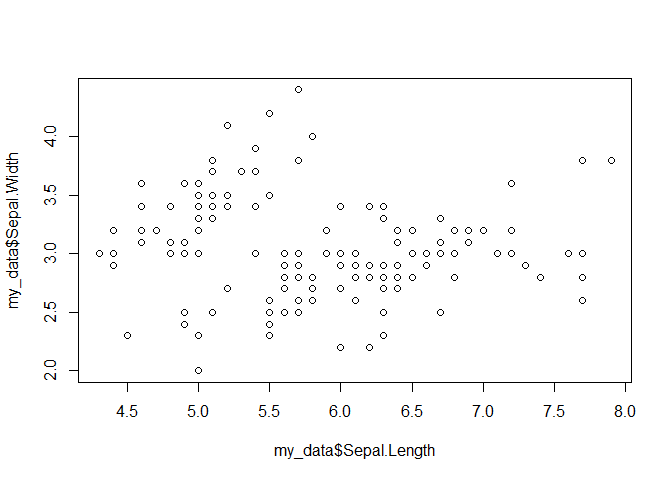
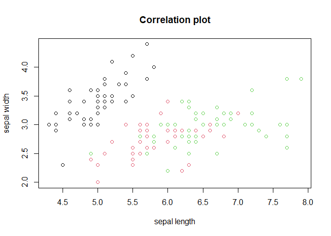
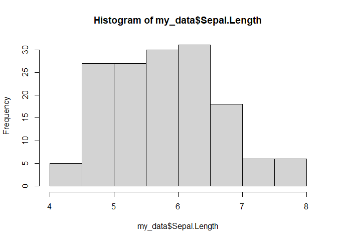
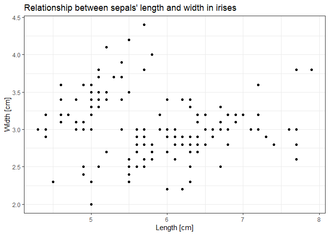
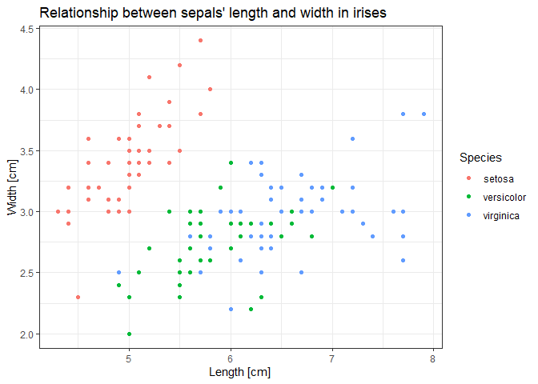
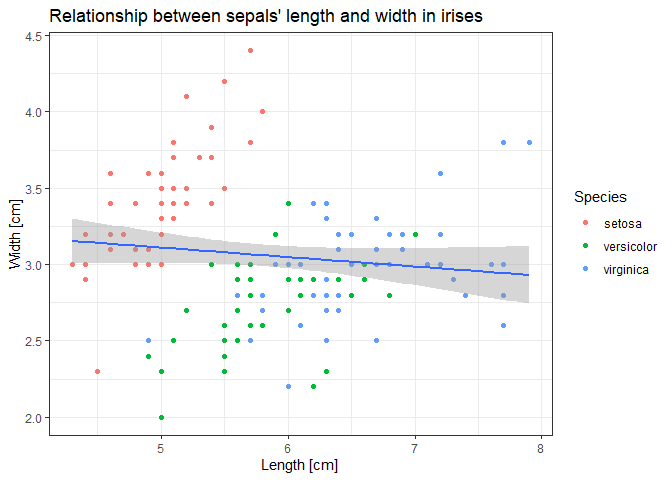
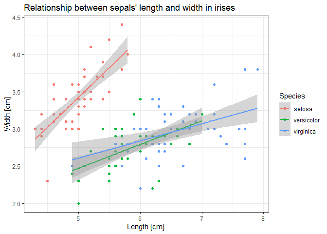
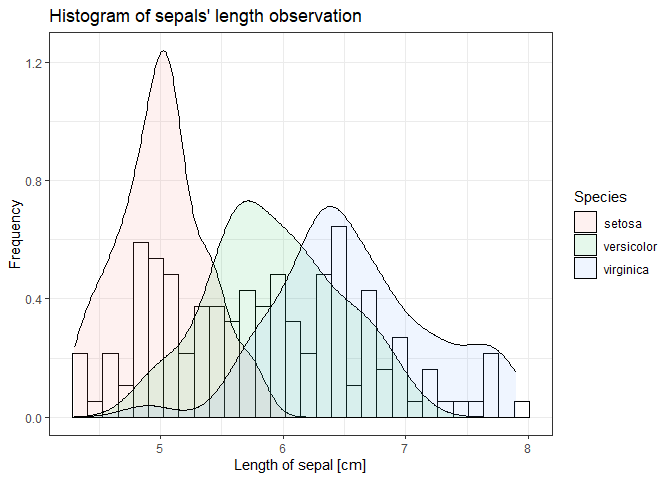

Introduction to R - class 5  Plotting: base
R and ggplot2
================
Tomasz Gaczorek, Wiesław Babik & Mateusz Chechetkin Marzena
Marszałek  <marzena.marszalek@doctoral.uj.edu.pl> 
2024-10-03

- [Basic plotting](#basic-plotting)
  - [**Exercise 1**](#exercise-1)
  - [Scatterplot](#scatterplot)
    - [**Exercise 2**](#exercise-2)
    - [**Exercise 3**](#exercise-3)
    - [**Exercise 4**](#exercise-4)
    - [**Exercise 5**](#exercise-5)
  - [Histogram](#histogram)
    - [**Exercise 6**](#exercise-6)
    - [**Exercise 7**](#exercise-7)
- [ggplot2](#ggplot2)
  - [Installation](#installation)
  - [Syntax](#syntax)
  - [Scatterplot](#scatterplot-1)
    - [**Exercise 8**](#exercise-8)
    - [**Exercise 9**](#exercise-9)
    - [**Exercise 10**](#exercise-10)
    - [**Exercise 11**](#exercise-11)
    - [**Exercise 12**](#exercise-12)
    - [**Exercise 13**](#exercise-13)
  - [Boxplot](#boxplot)
    - [**Exercise 14**](#exercise-14)
  - [Histogram](#histogram-1)
    - [**Exercise 15**](#exercise-15)
    - [**Exercise 16**](#exercise-16)
  - [**Exercise 17**](#exercise-17)
    - [**Exercise 18**](#exercise-18)
  - [Saving your images](#saving-your-images)
    - [**Exercise 19**](#exercise-19)
- [Homework](#homework)

**Data visualization** is a vital tool for statistics and research.
Plots, graphs, and other visual representations of data not only make
complex datasets **more accessible** but also reveal **patterns, trends,
and outliers** we might not notice otherwise. Base R provides all
necessary functions for creating quick plots that you can use for your
own information, e.g. in accessing **the distribution of data**. To make
plots more aesthetically pleasing, readable, and publication ready, we
will use `ggplot2` package.

## Basic plotting

During this class, we will be working on the internal dataset `iris`,
which describes various dimensions of flowers. You can access the
description of the dataset by typing a question mark before its name.
Here is a botanical visual of the flower structure.

### **Exercise 1**

**Assign the internal data set `iris` to an
object called `my_data`. View the dataset and create its short
summary.**

Expected result (first 10 rows):

    ##    Sepal.Length Sepal.Width Petal.Length Petal.Width Species
    ## 1           5.1         3.5          1.4         0.2  setosa
    ## 2           4.9         3.0          1.4         0.2  setosa
    ## 3           4.7         3.2          1.3         0.2  setosa
    ## 4           4.6         3.1          1.5         0.2  setosa
    ## 5           5.0         3.6          1.4         0.2  setosa
    ## 6           5.4         3.9          1.7         0.4  setosa
    ## 7           4.6         3.4          1.4         0.3  setosa
    ## 8           5.0         3.4          1.5         0.2  setosa
    ## 9           4.4         2.9          1.4         0.2  setosa
    ## 10          4.9         3.1          1.5         0.1  setosa

    ##   Sepal.Length    Sepal.Width     Petal.Length    Petal.Width   
    ##  Min.   :4.300   Min.   :2.000   Min.   :1.000   Min.   :0.100  
    ##  1st Qu.:5.100   1st Qu.:2.800   1st Qu.:1.600   1st Qu.:0.300  
    ##  Median :5.800   Median :3.000   Median :4.350   Median :1.300  
    ##  Mean   :5.843   Mean   :3.057   Mean   :3.758   Mean   :1.199  
    ##  3rd Qu.:6.400   3rd Qu.:3.300   3rd Qu.:5.100   3rd Qu.:1.800  
    ##  Max.   :7.900   Max.   :4.400   Max.   :6.900   Max.   :2.500  
    ##        Species  
    ##  setosa    :50  
    ##  versicolor:50  
    ##  virginica :50  
    ##                 
    ##                 
    ## 

The two most common types of plots are **scatterplots** and
**histograms**.

- **Scatterplots** display individual observations of two variables
  measured existing on a **continuous scale**. They are usually used to
  demonstrate a **relationship** (or lack thereof) between two traits or
  measures.  
- **Histograms**, on the other hand, display **frequencies** of
  observations (shown on the y axis of a graph) per category of
  observations (shown on the x axis).

Histograms are usually used to demonstrate differences between groups or
their central tendencies (e.g. means).

### Scatterplot

We’ll start with a scatterplot.  
The basic R function to create any kind of plot is, simply, `plot()`. To
set it up, provide arguments for data (the data frame it will use), x
axis, and y axis.

#### **Exercise 2**

**Create a simple plot using the `my_data`
data frame. Provide the sepal length column as x, and sepal width as y
arguments of the `plot()` function.**

Expected result:

<!-- -->

Alternatively, the same command can be given using the `~` (tilde) sign.
In coding language, this can be read as “depends on”, and is used not
only in plots, but also in e.g. statistical functions.

#### **Exercise 3**

**Create a plot using the same function but
writing the arguments down as **sepal width depending on sepal length**.
Provide the name of the data frame as data argument. Remember that, on a
standard plot, the y axis shows the dependent variable, and x shows the
independent variable.**

The only difference in the results should be the displayed titles for
the axes.

The basic `plot()` function allows us to somewhat customize the plots.
For example, we can change the name of the axes, as well as the title of
the plot.

#### **Exercise 4**

**Copy and modify the code that is creating
the plot. Add axes titles using the arguments `xlab` and `ylab`. Add the
title of the plot using the `main` argument.**

Remember that, for any function, you can always access its manual by
typing its name with a question mark at the beginning into the R
console.

> **Curiosity** You can use the `par()` function to further customize
> the plot. Inspecting the manual will show you the various options you
> have.

What if we want to add grouping to the scatterplot? We can add another
argument to the function too, for example, color the individual
observations according to group.

#### **Exercise 5**

**Modify the plot function to color the
observations by `Species`. Do this by adding a `col` argument and
setting the `Species` column as its value.**

Expected result:

<!-- -->

> **Curiosity** The basic plot function allows further modification,
> such as, e.g., addition of a legend to the plot. We will not focus on
> this as making the plots more readable is easier in `ggplot2`.

### Histogram

Now let’s try to make a histogram.

The base R function for making a histogram is `hist()`. The only
argument you need to provide is the column of the data you want to work
on. The group of the observations will be shown on the x axis, and the
frequency of occurrences of observations in that group will be shown on
the y axis.

#### **Exercise 6**

**Create a histogram plot of the sepal length
using `my_data`.**

Expected outcome:

<!-- -->

You can customize this plot using the same arguments as in the `plot()`
function to add axes labels and a title. Additionally, we can adjust
some other things about this plot, for example changing the grouping on
the x axis using the `breaks` argument. The `breaks` argument can take a
single number (which will correspond to the number of bins) or a numeric
vector (which will correspond to the boundaries of the bins).

#### **Exercise 7**

**Update the histogram code by adding axes
names, title, and setting it to display 4 bins.**

## ggplot2

### Installation

From now on, we are going to use the `ggplot2` package. To install it go
to Tools \>\> Install Packages… or type:

`install.packages("ggplot2")`

Remember to load the package after it installs.

### Syntax

The syntax to generate a plot includes three groups of functions:

- **the base** - `ggplot()` - starts a new plot  
- **the body** - e.g.`geom_point()` - displays the data  
- **the layout** - e.g. `theme()` - changes the appearance of a plot

You can use many functions that will contribute to a given plot but each
of them should be connected by the plus symbol (`+`)
e.g. `ggplot(…) + geom_point() + geom_line() + theme(…)`.

Both the `ggplot()` and the body functions share two crucial arguments:

- `data` - data frame based on which plotting should be performed  
- `mapping` - the value needs to be a in form of `aes()` (aesthetic)
  function with following arguments:
  - `x` - name of the column with values for the x (horizontal) axis
    (without quotation marks)  
  - `y` - name of the column with values for the y (vertical) axis
    (without quotation marks)

Note that the arguments passed to the `ggplot()` function are
“parental”. It means they would be used if no arguments are provided for
the body functions. It is called inheritance in the programming (because
every subsequent function in the line “inherits” the arguments of the
parent function).

*An advice: At the beginning, to make it intuitive, provide the data
argument within `ggplot()` function and the mapping argument to each of
the body functions
e.g. `ggplot(data = my_data) + geom_point(mapping = aes(x = column1, y = column2))`.
The meaning is as follows:*  
*1. Use `my_data` data frame as the source of the data for all
subsequent body functions that create the plot elements*  
*2. Use `column1` as the values on the x axis and `column2` as the
values on the y axis and generate a point for each observation*

### Scatterplot

#### **Exercise 8**

**Create a scatterplot presenting the
relationship between sepals’ length and width. Use `geom_point()`
function for points generation.**

Expected result:

<!-- -->

Now, let’s make it pretty!

1.  Decide on the general appearance by the choice of a given `theme…()`
    function. For statistics, I highly recommend using `theme_bw()` as
    it removes unnecessary background. To check all built-in
    possibilities follow the
    [link](https://ggplot2.tidyverse.org/reference/ggtheme.html). Be
    aware that the choice of any specific `theme…()` function reduces
    adjustment flexibility. The other option is to use plain `theme()`
    function and adjust all characteristics on your own.  
2.  Set proper labels by using `labs()` function with arguments: `title`
    for the title of plot, `x` for x-axis label and `y` for y-axis
    label.

#### **Exercise 9**

**Modify previous scatterplot by setting
`theme_bw()` function. Also, set a main title and axis labels according
to the plot below.**

Expected result:

<!-- -->

As you have seen in the dataset description, the observations were
collected for the three species of irises. To display them in different
colors add color argument to `geom_point()` aesthetic and set it as the
name of column with species description for each observation. Notice
that the legend will be automatically added.

#### **Exercise 10**

**Modify previous scatterplot by displaying
the observations from different species with distinct colors.**

Expected result:

<!-- -->

> **Curiosity**  
> There is an entire family of the scale…() functions that personalize
> the way observations are displayed e.g.:  
> 1. `scale_x_discrete(`) (for groups), `scale_x_continuous()` (for
> gradient) - modify x axis functionalities (e.g. its \>range)  
> 2. `scale_y_discrete()` (for groups), `scale_y_continuous()` (for
> gradient) - modify y axis functionalities (e.g. its \>range)  
> 3. `scale_color_manual()` - to set personalized colors and legend
> labels

Points alone are often not enough to see a trend. To make a proper
justification we need a **regression line**. You can draw it by adding
`geom_smooth()` function to the plot’s body. Remember about required
arguments (either assigned or inherited). Also, to obtain the linear
regression, set argument `method` to `lm`.

#### **Exercise 11**

**Draw a linear regression line for the
scatterplot from exercise 10.**

Expected result:  
Regression line in blue, gray area represents confidence intervals
generated by default.

<!-- -->

It seems that there is **no relationship** when you consider **all
points together** but what about **relationships within species**? Do it
by adding color argument to the `geom_smooth()` aesthetics and setting
it as the name of column with species description for each observation.

#### **Exercise 12**

**Modify a scatterplot from exercise 11 to
obtain separate regression lines for each species.**

Expected result:

<!-- -->

> **Curiosity** Using `group` argument instead of color will also
> generate separate lines but all will be of the same color.

Plotting lines works in exactly same way but with the use of
`geom_line()` function. Note that points on scatterplots should not be
connected with lines unless you want to represent a connection between
the points (e.g. change in temperature from one day to another). This is
not the case in the iris data set. However, for the sake of practicing,
we can still do it.

#### **Exercise 13**

**Take the scatterplot from exercise 10, but
instead of points add lines representing similar relationship for petals
across species.**

Expected result:

<!-- -->

### Boxplot

Until now, we were working on plots with continuous values on x and y
axes. What if we want to plot sepal width alone over all species? As
species are on discrete scale (class of column is factor) we should
consider a boxplot. Generate it in the similar way with the use of
`geom_boxplot()` function.

#### **Exercise 14**

**Generate a boxplot representing the sepal’s
length across different iris species.**

Expected result:

<!-- -->

*An advice: If you do not know how to interpret the boxplot, follow the
[link](https://wellbeingatschool.org.nz/information-sheet/understanding-and-interpreting-box-plots).*

### Histogram

Another commonly used type of a plot is a **histogram**. It depicts the
**number of observations within given ranges of values**. Generate it
with the `geom_histogram()` function. Specify the aesthetics for x-axis
only as y-values are computed by R.

#### **Exercise 15**

**Generate a histogram of sepal
length.**

Expected result:

<!-- -->

*An advice: To set a common color for all bars, use `fill` and `color`
argument of `geom_histogram()` function and provide it with a color
name. It would set the color of filling and contours respectively.*

You can also think about histograms as **calculating the frequency**
rather than the number of observations. To do this set the `y` argument
of `geom_histogram()` aesthetics to `(..count..)/sum(..count..)` . Note
that `..count..` is an internal `ggplot` symbol for the frequency
calculation.

#### **Exercise 16**

**Generate a histogram of sepal length with
the relative frequencies on the y axis.**

Expected result:

    ## Warning: The dot-dot notation (`..count..`) was deprecated in ggplot2 3.4.0.
    ## ℹ Please use `after_stat(count)` instead.
    ## This warning is displayed once every 8 hours.
    ## Call `lifecycle::last_lifecycle_warnings()` to see where this warning was
    ## generated.

<!-- -->

Note that the histograms looks almost identical but the **y-axis values
were changed**.

Using histograms, you can also generate a **density distribution**.
Think about it as the graphical visualization of relative probabilities
that a **randomly sampled observations come from a given interval**.
Note that sampling based on density function would generate the
histogram similar to the one from the real-data. It can be used to
**roughly assess the normality of data**. Do it by changing y argument
of `geom_histogram()` function to `..density..`. Additionally, use
`geom_density()` function. Remember about aesthetics’ argument `x` and
note you can use `alpha` argument to set distribution transparency.

### **Exercise 17**

**Modify the histogram from exercise 16th by
adding density distribution.**

Expected result:

<!-- -->

#### **Exercise 18**

**Modify the histogram above and display
density distributions for each species separately on a single plot. Take
advantage of `color` argument inside aesthetics.**

Expected result:

<!-- -->

### Saving your images

When R generates plots based on our commands, they are treated like any
other object – meaning that **they are not automatically stored in the
app memory unless we save the code that generates them or export the
images out of R studio**. There are 2 main ways to do this:

- through user interface, using export \>\> save as an image file or
  copying the image directly into the clipboard and pasting it into a
  word document or an image editor such as MS Paint; for reference, see
  [this
  guide](http://www.sthda.com/english/wiki/creating-and-saving-graphs-r-base-graphs).  
- using lines of code

If you only need to save one image, both options are equally convenient.
If, however, you are generating multiple plots per script, it can be
faster to include code that saves them after every line that generates
the image.

In base R, to save a plot, you need to enclose in a save function. It
looks like this:

`png(“[name].png”)`  
`plot([arguments])`  
`dev.off()`

Other than .png, you can save it in .jpg, .bmp, and .tiff formats, using
corresponding functions. Remember that **by default, R will save the
image to your working directory**.

In `ggplot`, we can use the function `ggsave()`. **By default, it saves
the last plot generated in the code**. It takes the name of a file to be
generated (with a format extension) as the main argument, and it can be
adjusted using many other arguments. For example:
`ggsave(“scatterplot_1.pdf”, width = 20, height = 20, units = 'cm')`

#### **Exercise 19**

**Save one of the plots we generated today
using your preferred method.**

## Homework

  Use the built in `mtcars` data set
for all exercises. As a reminder, you can pull up a description of the
inbuilt data set by typing a question mark before its name into the R
console.  1. Using base R, generate a scatterplot to demonstrate a
relationship between any 2 continuous variables. Add a grouping by
`colour` to the plot, descriptions of axes, and a title.  2. Using
base R, generate a histogram for any appropriate variable. Set the
number of bins on it to 5, add axes descriptions, and plot title. 3.
Load the `ggplot2` library and use it for all subsequent tasks. Draw a
scatterplot of cars’ horsepower against weight. Include a regression
line to check the relationship.  4. Group values in the above
scatterplot based on the number of cylinders. Does it change the
relationship  5. Plot a relationship between the number of forward
gears and rate of combustion (miles/per gallon). 

**Save all the graphs with your
preferred method. Upload your R script (including commands for saving
graphs) on the *Pegaz* platform. Do not upload graph files
itself!**
