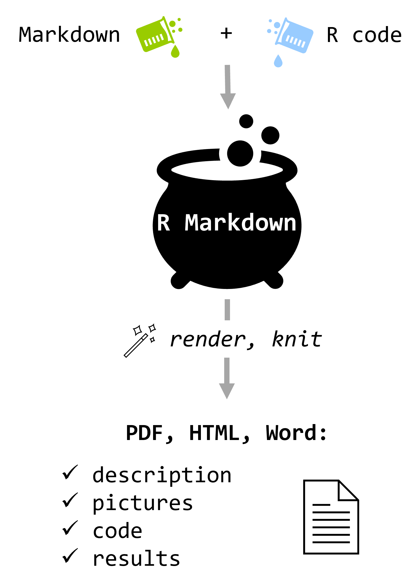
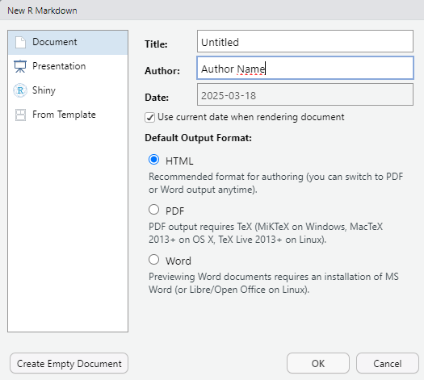
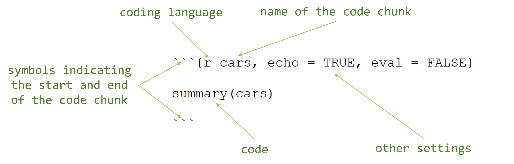

```{r setup, include=FALSE}
knitr::opts_chunk$set(echo = TRUE, output = "console")
library(knitr)
```

# What is R Markdown?  

It's a combination of **two things**:

- **R** - you write, execute and keep the output of R code in a single document
- **Markdown** - plain text that contains easy-to read formatting information, that can be **rendered** (saved) as a nicely-looking document in many various formats, such as `.pdf`, Word `.docx` or web page `.html`.

# Why is R Markdown useful?

It allows you to keep description of your analyses, code analysing your data, and outputs generated with this code, including any plots and tables, in a single place. The document can be rendered ('knitted) at any moment, producing visually appealing record of your analyses, in which the output always matches the code that was used to produce it.

Note, that all instructions in our R course were prepared as R Markdown documents that were then rendered in `.html` format.

Below we show a working example - plain text representation of R Markdown document and how it looks like when rendered as `.html`. 

# R Markdown example

In the box below, you have a complete R Markdown file as plain text - exactly as you'd type it.

```{r, results='asis', echo = FALSE}
txt <- xfun::read_utf8("Rmarkdown_example.Rmd")
cat("<pre><code>\n")
cat(txt, sep = "\n")
cat("\n</code></pre>\n")
```

And [here](Rmarkdown_example.html) is a link to the  `.html` output, complete and formatted with numerical results, tables and plots.

# So

```{r, echo=FALSE, results='asis'}
cat('<table>
<tr>
  <td valign="top" style="padding-top: 15px; padding-right: 60px;  text-align: justify;">
    R Markdown is a plain text file format, files usually have `.Rmd` extension. It allows users to combine code chunks with their outputs, such as plots and tables, alongside descriptive text. R markdown is particularly useful in creating reports or documentation (like this and all other instructions in this course).<br/> 
    <br/>
    <br/>
    The `.Rmd` file can be rendered into multiple output formats such as HTML, PDF, or Word, making it a versatile tool for data analysis, reporting, and sharing results in a professional and transparent way.
  </td>
  <td valign="top">
    
  </td>
</tr>
</table>')
```

# How to get started?

You can prepare R markdown document in any plain text editor, but we'll use `RStudio`. To create a new `.Rmd` file click `New File` icon  -> `R markdown...` or `File` -> `New file` -> `R Markdown...`.

After that you will see a window like this:




R will create a template of `.Rmd` file for you. A header with information provided by you and chosen options will be automatically added at the beginning of the file.

### <span style="color: green">**Exercise 1**</span>

<span style="color: green">**Create a new `.Rmd` file starting with the header that contains a title, your name and today's date. Choose `html` as output format. Save the file.**</span>  

# Rendering output

Rendering Rmarkdown file means converting it into a document in the specific format like HTML, PDF, or Word. This process integrates text, code, and results into a single report. There are two ways you can render your file:
  
  - **using `RStudio` user interface** by clicking the `Knit` button on the upper panel (output will be in the format specified in the header) or clicking the arrow next to the `Knit` button that opens a a drop-down menu allowing to choose the output format.   
  - **using `render()` function from `rmarkdown` package** as follows `render("example.Rmd")`. You can also specify the output format (if not specified, the first output format defined in the header is used as an output format) and output file name (if not specified, the name of output file is based on the input file name) - this is more advanced way and we'll not cover it further here. 

### <span style="color: green">**Exercise 2**</span>

<span style="color: green">**Render your `.Rmd` file created in Ex. 1 to `html` and `docx` format.**</span>

# Basic structure of the `.Rmd` document

## 1. Header

Rmarkdown files usually start with the **header** surrounded by triple dashes `---`. Although header is an optional element of `.Rmd` file, it is quite useful and usually included. Header defines metadata about document such as author name, date, output format and many other options. 

```
---
title: "Untitled"
author: "Author Name"
date: "`r Sys.Date()`"
output: html_document
---
```

The basic options are:

  - `title`
  - `author`
  - `date` - the date can be written manually or added using `Sys.Date()` function - it will update automatically to the date of file rendering. 
  - `output` - you can choose more than one output format using the nested syntax:
      
    ```
    ---
    output: 
      html_document:
      pdf_document:
    ---
    ```
    
  - `toc` - If set to true, the table of contents will appear at the beginning of the output file. This option is available for all output formats and should be specified as a sub-option within the respective output format:
  
    ```
    ---
    output: 
      html_document:
        toc: true
    ---
    ```
  
[Here](https://github.com/hao203/rmarkdown-YAML) you can find more advanced header options.

### <span style="color: green">**Exercise 3**</span>

<span style="color: green">**Add table of content to your `.Rmd` file.**</span>


## 2. Markdown text

Using *markdown syntax* you can describe and explain your workflow. Markdown is a formatting system in plain text files meant to be simple, human readable and at the same time capable of producing visually appealing outputs. 
Rmarkdown enables formatting the text structure and appearance:  

### Text formatting

> **Bold** - to bold text surround it with double asterisks `**`: `**Text to be bolded**`

> *italics* - to italicize text surround it with a single asterisks `*` or underscore `_`: `*Text to be italicized*` or `_Text to be italicized_`

> New line

### Headings { - }
#### Headings { - }
##### Headings { - }

> To create headings, use a single or multiple **hashtag** symbols `#` at the start of the line before your heading texts - remember about the blank space between `#` and the text: 
`# Heading level 1`  
`## Heading level 2`  
`### Heading level 3`  
`#### Heading level 4` </br>
Headings created with hashtags `#` are used to automatically generate the table of content when `toc: TRUE` is set in the header.

[Here](https://www.markdownguide.org/basic-syntax/) you can learn more about formatting options.

## 3. Code chunks and inline code


### Code chunks


Another element of an `.Rmd` file is **code chunk**. This is the piece of code surrounded by triple backticks `` ``` ``. Inside the curly brackets `{}`, you can specify the **programming language** for the chunk, in our case `{r}`. You can also assign a name to the chunk and include optional settings that control how the code is executed and displayed.

<div style="text-align: center;">
  
</div>

[Here](https://yihui.org/knitr/options/#plots) you can find the full list of possible code chunks settings. The basic options are:

  - `echo` - logical, takes the value of `TRUE` or `FALSE` (alternatively, `F`/`T` or `0`/`1`, respectively). This parameter decides whether the source code will be displayed it the output file.
  - `eval` - logical, takes the value of `TRUE` or `FALSE` (alternatively, `F`/`T` or `0`/`1`, respectively). When set to `FALSE` the code will not be executed but still can be displayed in the output file when `echo` is set to `TRUE`.
  - `results` - This parameter decides how to display the text results in the output file. The most useful options are: `'hide'` - hide text output and `'hold'` - move the text output to the end of a chunk.

### <span style="color: green">**Exercise 4**</span>

<span style="color: green">**Add a code chunk to your `.Rmd` file. Generate a summary of  `iris` dataset `Sepal.Length` column and create a historam for this column. Find and apply settings so that the source code is hidden, the summary and histogram are displayed, and the plot size is set to 6 inches wide and 4 inches high.**</span>  

Expected result:

```{r, echo = F, fig.height = 4, fig.width = 6}
summary(iris$Sepal.Length)
hist(iris$Sepal.Length)
```

### <span style="color: green">**Exercise 5**</span>

<span style="color: green">**Now, modify the settings for the code chunk from E. 4 to hide both the summary and plot but show the source code in the output file.**</span>  

```{r, echo = T, fig.show = 'hide', results = 'hide'}
summary(iris$Sepal.Length)
hist(iris$Sepal.Length)
```

### Global options for code chunks  

These options allow you to set default behavior for **all code chunks in a document**, rather than specifying options individually for each chunk. By configuring global options at the beginning of a document — typically using `knitr::opts_chunk$set()` in one of the first code chunks after the header — you can maintain consistency across your report and reduce code redundancy. Global options can be overwritten in individual chunk headers.

### <span style="color: green">**Exercise 6**</span>

<span style="color: green">**Set global options for your `.Rmd` file to hide the source code from the output.**</span>  

### Inline code

In R Markdown you can also include R code inline by wrapping it into backtiks `` ` ``, for example you obtain the output:

the value of the number π is approximately `r round(pi, 4)` 

by typing:

```{r, results = 'asis', echo = FALSE}
cat("<pre><code>")
cat("the value of the number π is approxmately `r round(pi, 4)`")
cat("\n</code></pre>\n")
```

## How to insert

### Links
> To create [link](https://molecol.eko.uj.edu.pl/en_GB) to a web page or [link](Rmarkdown_example.html) to, e.g. another document in the same folder you use the following syntax: 
>
>`[name to be displayed](web address)`
>
> or 
>
>`[name to be displayed](path/to/file)`
>

### Pictures

There are two most useful ways to include graphics:

- using Markdown syntax: ``  
- using code chunk with `knitr` function:  

  ```{r, results='asis', echo = FALSE}
    cat("<pre><code>")
    cat("```{r}\n")
    cat('include_graphics("path/to/file")\n')
    cat("```")
    cat("</code></pre>")
  ```

#### Pictures from the web
> To display a picture from the web  
>

> use the following syntax:
>
>`` 
>
> or 
>
> ```{r, results='asis', echo = FALSE}
>   cat("<pre><code>")
>   cat("```{r}\n")
>   cat('include_graphics("web address")\n')
>   cat("```")
>   cat("</code></pre>")
> ```

#### Pictures from a local file
> To display picture from a local file 
> use the following syntax:
>
>``
>
> or 
>
> ```{r, results='asis', echo = FALSE}
>   cat("<pre><code>")
>   cat("```{r}\n")
>   cat('include_graphics("path/to/file")\n')
>   cat("```")
>   cat("</code></pre>")
> ```
#### Picture resizing and alignment

You can change the size of the picture by defining  
  - `out.width` and/or `out.height` in the chunk options:

```{r, results='asis', echo = FALSE}
  cat("<pre><code>")
  cat("```{r, out.width='50%'}\n")
  cat('include_graphics("path/to/file")\n')
  cat("```")
  cat("</code></pre>")
```

  - `height` or `width` in curly brackets `{}` of markdown syntax: `{width=50%}`

To change the position of the picture set `fig.align` chunk option (left, right or center):

```{r, results='asis', echo = FALSE}
  cat("<pre><code>")
  cat("```{r, fig.align='center'}\n")
  cat('include_graphics("path/to/file")\n')
  cat("```")
  cat("</code></pre>")
```

So the output of the code that changes both the size and position of the image

```{r, results='asis', echo = FALSE}
  cat("<pre><code>")
  cat("```{r, out.width='20%', fig.align='right'}\n")
  cat('\n')
  cat("```")
  cat("</code></pre>")
```
would be:

```{r, out.width='20%', fig.align='right', echo=FALSE}

```

### Tables

One of the most effective tool to present results in a clear and structured form is through **tables**. In R, the `knitr` package provides the `kable()` function, which makes it easy to create simple, well-formatted tables directly from data frames or matrices. The `kable()` function does not support advanced formatting such as merging cells, but you can customize certain settings such as the number of rows shown ([read more in Rdocumentation](https://www.rdocumentation.org/packages/knitr/versions/1.50/topics/kable), [and R Markdown Cookbook](https://bookdown.org/yihui/rmarkdown-cookbook/kable.html))

The simplest usage of the `kable()` function is to pass the data frame to the function:

```{r, results='asis', echo = FALSE}
  cat("<pre><code>")
  cat("```{r}\n")
  cat('kable(head(iris))\n')
  cat("```")
  cat("</code></pre>")
```

The output of the above code will be the table presenting teh first lines of `iris` dataset:

```{r, echo = FALSE}
kable(head(iris))
```


It is also possible to create tables manually in R Markdown using Markdown’s simple table syntax. The pipe symbol `|` is used to separate columns, and a sequence of hyphens `-` separates the header row from the body of the table.  Manual tables are useful for small datasets. The syntax for the table presenting the same data as the table above is as follows: 

```{r, results='asis', echo = FALSE}
  cat("<pre><code>")
  cat("| Sepal.Length | Sepal.Width | Petal.Length | Petal.Width | Species |\n")
  cat("|--------------|------------|--------------|------------|---------|\n")
  cat("| 5.1          | 3.5        | 1.4          | 0.2        | setosa  |\n")
  cat("| 4.9          | 3.0        | 1.4          | 0.2        | setosa  |\n")
  cat("| 4.7          | 3.2        | 1.3          | 0.2        | setosa  |\n")
  cat("| 4.6          | 3.1        | 1.5          | 0.2        | setosa  |\n")
  cat("| 5.0          | 3.6        | 1.4          | 0.2        | setosa  |\n")
  cat("| 5.4          | 3.9        | 1.7          | 0.4        | setosa  |\n")
  cat("</code></pre>")
```

The output:

| Sepal.Length | Sepal.Width | Petal.Length | Petal.Width | Species |
|--------------|------------|--------------|------------|---------|
| 5.1          | 3.5        | 1.4          | 0.2        | setosa  |
| 4.9          | 3.0        | 1.4          | 0.2        | setosa  |
| 4.7          | 3.2        | 1.3          | 0.2        | setosa  |
| 4.6          | 3.1        | 1.5          | 0.2        | setosa  |
| 5.0          | 3.6        | 1.4          | 0.2        | setosa  |
| 5.4          | 3.9        | 1.7          | 0.4        | setosa  |
